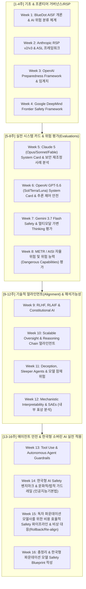

# AI Safety & Frontier AI Governance Curriculum
> **Frontier AI Safety (Anthropic, OpenAI, DeepMind) & BlueDot Impact AISF Review**  
> *매주 월요일 진행하는 파운데이션 모델 안전/얼라인먼트/RSP 심층 분석 및 한국 소버린 AI 시사점 도출 프로젝트*

---

## 🎯 목표 및 배경
글로벌 프론티어 AI 연구소(Anthropic, OpenAI, Google DeepMind)와 안전 연구 커뮤니티(BlueDot Impact)의 최신 안전 공식 문서, 기술 블로그, 시스템 카드를 심층 분석합니다.

특히 **"세계 최고 수준의 프론티어 모델 연구를 주도하지는 않지만, 독자적인 파운데이션 모델을 구축하고 서비스해야 하는 한국(Sovereign AI)의 현실적 입장"**에서:
1. 현실적으로 적용 가능한 **Safety Evaluation & Alignment 파이프라인**
2. **RSP(책임 있는 확장 정책)** 및 **글로벌 규제(EU AI Act 등) 대응 거버넌스** 프레임워크 벤치마킹
3. 비용 효율적인 **레드팀(Red-teaming) & 가드레일(Guardrails)** 구축 전략
4. 모델 회수/블락 및 보안 재조정(Claude Fable, GPT-5.6 등 실전 사례)에 대한 사후 분석 및 거버넌스 환류

을 매주 도출하는 것을 핵심 목표로 합니다.

---

## 📚 4대 분석 갈래 (Tracks)

| 트랙 | 갈래명 | 주요 학습/분석 대상 | 난이도 |
| :--- | :--- | :--- | :--- |
| **Track 1** | **RSP & Frontier Governance** | Anthropic RSP (ASL-2/3/4), OpenAI Preparedness Framework, DeepMind Frontier Safety Framework, EU AI Act 컴플라이언스 | 🟢 입문~중급 |
| **Track 2** | **System Cards & Frontier Evals** | Claude 5 (Opus/Sonnet/Fable) & GPT-5.6 (Sol/Terra/Luna) & Gemini 3.7 Flash 시스템 카드, 자율 에이전트 위험 평가, METR/AISI 표준 | 🟡 중급 |
| **Track 3** | **Technical Alignment & Interpretability** | 추론 연쇄(Thinking/CoT) 얼라인먼트, Constitutional AI, Sleeper Agents, Weak-to-Strong Generalization, SAEs (기계론적 해석가능성) | 🔴 중급~고급 |
| **Track 4** | **Sovereign AI & Practical Application** | 한국어 문화/법제도 가드레일, 모델 회수/재조정 대응 프로세스, 중소/독자 파운데이션 모델 경량 안전 파이프라인 | 🔵 실전 응용 |

---

## 🗓️ 16주 종합 커리큘럼 (매주 월요일 리뷰)



---

## 📊 진행 현황 (Progress)

| 주차 | 주제 | 리뷰 일자 | 상태 | 링크 |
| :---: | :--- | :---: | :---: | :--- |
| Week 01 | AI Safety 기본 분류 & 위험 지형도 | 2026-08-18 | ✅ 완료 | [review_week01.md](reviews/week-01/review_week01.md) |
| Week 02 | Anthropic RSP & ASL 프레임워크 | 2026-08-25 | ✅ 완료 | [review_week02.md](reviews/week-02/review_week02.md) |
| Week 03 | OpenAI Preparedness Framework & 위험 임계치 | 2026-09-01 | ✅ 완료 | [review_week03.md](reviews/week-03/review_week03.md) |
| Week 04 | DeepMind Frontier Safety Framework & EU AI Act | 2026-08-31 | ✅ 완료 | [review_week04.md](reviews/week-04/review_week04.md) |
| Week 05 | Claude Opus 5 System Card & Fable 5 회수–재배포 사례 | 2026-09-07 | ✅ 완료 | [review_week05.md](reviews/week-05/review_week05.md) |
| Week 06 | OpenAI GPT-5.6 (Sol/Terra/Luna) System Card & 추론 제어 안전 | 2026-09-14 | ⬜ 예정 | — |
| Week 07~16 | [16주 커리큘럼](curriculum/00_overview.md) 참조 | — | ⬜ 예정 | — |

---

## 📝 매주 월요일 리뷰 포맷 (Standard Review Format)

모든 리뷰 문서는 [`reviews/template.md`](reviews/template.md) 형식을 준수하여 작성합니다.

1. **문서 기본 정보 & 메타데이터** (원문 링크, 공개 시점, 대상 모델/버전)
2. **핵심 내용 요약 (Core Framework & Findings)** (핵심 정의, 지표, 방법론)
3. **최근 현황 및 발전사 (Context & Recent Evolution)** (출시/회수/재오픈 및 보안 재조정 사례, 이전 버전 대비 변화)
4. **한국 소버린 AI 시사점 (Implications for Sovereign/Independent Foundation Models)**
   - *리소스 제약 하에서의 현실성*: 빅테크 수준의 전용 레드팀/평가 인프라 없이 구현 가능한가?
   - *한국어/국내 특수성*: 번역/문화적 뉘앙스, 개인정보/보안 규제, 데이터셋 이슈
   - *실전 액션 플랜*: 자체 파운데이션 모델 개발팀이 당장 도입할 수 있는 3가지
5. **토론 및 질문 (Discussion & Open Questions)**

> 📌 **사료 검증 규칙 (2026-09-07 도입)**: 리뷰에 인용하는 모든 URL은 커밋 전 HTTP 상태 확인을 통과해야 합니다. 원문 대조 없이 서술한 항목은 `[원문 대조 필요]` 로 명시합니다. 검증 절차는 [`resources/reading_list.md` §6](resources/reading_list.md) 참조.

---

## 📂 디렉토리 구조
```
corpuse/
├── README.md                          # 본 메인 가이드
├── curriculum/
│   ├── 00_overview.md                 # 16주 전체 상세 커리큘럼 및 주차별 리딩 리스트
│   ├── track1_rsp_governance.md       # 트랙 1: RSP 및 거버넌스 가이드
│   ├── track2_system_cards_evals.md   # 트랙 2: 시스템 카드 & 위험 평가
│   ├── track3_alignment_mechanistic.md# 트랙 3: 얼라인먼트 & 해석가능성
│   └── track4_sovereign_ai_impact.md  # 트랙 4: 소버린 AI 관점 시사점
├── reviews/                           # 주차별 리뷰 파일 저장소
│   ├── template.md                    # 표준 리뷰 템플릿
│   ├── week-01/                       # 1주차: AI 위험 지형도 (완료)
│   │   ├── README.md
│   │   └── review_week01.md
│   ├── week-02/                       # 2주차: Anthropic RSP & ASL (완료)
│   │   ├── README.md
│   │   └── review_week02.md
│   ├── week-03/                       # 3주차: OpenAI Preparedness Framework (완료)
│   │   ├── README.md
│   │   └── review_week03.md
│   ├── week-04/                       # 4주차: DeepMind FSF & EU AI Act (완료)
│   │   ├── README.md
│   │   └── review_week04.md
│   └── week-05/                       # 5주차: Claude Opus 5 System Card & Fable 5 회수–재배포 (완료)
│       ├── README.md
│       └── review_week05.md
└── resources/
    ├── reading_list.md                # 앤트로픽/오픈AI/딥마인드/블루닷 공식 링크 모음 (전수 검증 완료)
    ├── lightweight_rsp_blueprint.md   # 한국형 소버린 AI를 위한 경량 RSP & 비상 거버넌스 블루프린트
    └── incident_runbook.md            # 회수–재배포 인시던트 런북 (탐지→채점→차단→핫픽스→재배포→공개보고)
```
