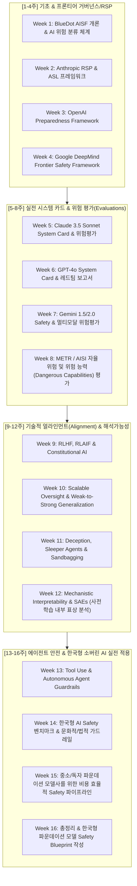

# AI Safety & Frontier AI Governance Curriculum
> **Frontier AI Safety (Anthropic, OpenAI, DeepMind) & BlueDot Impact AISF Review**  
> *매주 월요일 진행하는 파운데이션 모델 안전/얼라인먼트/RSP 심층 분석 및 한국 소버린 AI 시사점 도출 프로젝트*

---

## 🎯 목표 및 배경
글로벌 프론티어 AI 연구소(Anthropic, OpenAI, Google DeepMind)와 안전 연구 커뮤니티(BlueDot Impact)의 최신 안전 공식 문서, 기술 블로그, 시스템 카드를 심층 분석합니다.

특히 **"세계 최고 수준의 프론티어 모델 연구를 주도하지는 않지만, 독자적인 파운데이션 모델을 구축하고 서비스해야 하는 한국(Sovereign AI)의 현실적 입장"**에서:
1. 현실적으로 적용 가능한 **Safety Evaluation & Alignment 파이프라인**
2. **RSP(책임 있는 확장 정책)** 및 **규제 대응(거버넌스)** 프레임워크 벤치마킹
3. 비용 효율적인 **레드팀(Red-teaming) & 가드레일(Guardrails)** 구축 전략
을 매주 도출하는 것을 핵심 목표로 합니다.

---

## 📚 4대 분석 갈래 (Tracks)

| 트랙 | 갈래명 | 주요 학습/분석 대상 | 난이도 |
| :--- | :--- | :--- | :---: |
| **Track 1** | **RSP & Frontier Governance** | Anthropic RSP (ASL-2/3/4), OpenAI Preparedness Framework, DeepMind Frontier Safety Framework, BlueDot AI Governance | 🟢 입문~중급 |
| **Track 2** | **Model/System Cards & Danger Evals** | Claude/GPT-4o/Gemini System Cards, METR 자율성 평가, US/UK AISI 표준, 사이버/생화학(CBRN) 위험 평가 | 🟡 중급 |
| **Track 3** | **Technical Alignment & Interpretability** | BlueDot AISF Alignment, Constitutional AI, Sleeper Agents, Weak-to-Strong Generalization, SAEs (기계론적 해석가능성) | 🔴 중급~고급 |
| **Track 4** | **Sovereign AI & Practical Application** | 한국어 문화/법제도 가드레일, 중소/자체 파운데이션 모델을 위한 경량 위험평가 체계, Agentic AI 안전 | 🔵 실전 응용 |

---

## 🗓️ 16주 종합 커리큘럼 (매주 월요일 리뷰)



---

## 📝 매주 월요일 리뷰 포맷 (Standard Review Format)

모든 리뷰 문서는 [`reviews/template.md`](reviews/template.md) 형식을 준수하여 작성합니다.

1. **문서 기본 정보 & 메타데이터** (원문 링크, 공개 시점, 대상 모델/버전)
2. **핵심 내용 요약 (Core Framework & Findings)** (핵심 정의, 지표, 방법론)
3. **최근 현황 및 발전사 (Context & Recent Evolution)** (이전 버전 대비 달라진 점, 최신 연구와의 연계)
4. **한국 소버린 AI 시사점 (Implications for Sovereign/Independent Foundation Models)**
   - *리소스 제약 하에서의 현실성*: 빅테크 수준의 전용 레드팀/평가 인프라 없이 구현 가능한가?
   - *한국어/국내 특수성*: 번역/문화적 뉘앙스, 개인정보/보안 규제, 데이터셋 이슈
   - *실전 액션 플랜*: 자체 파운데이션 모델 개발팀이 당장 도입할 수 있는 3가지
5. **토론 및 질문 (Discussion & Open Questions)**

---

## 📂 디렉토리 구조
```
corpuse/
├── README.md                          # 본 메인 가이드
├── curriculum/
│   ├── 00_overview.md                 # 16주 전체 상세 커리큘럼 및 주차별 리딩 리스트
│   ├── track1_rsp_governance.md       # 트랙 1: RSP 및 거버넌스 가이드
│   ├── track2_system_cards_evals.md   # 트랙 2: 시스템 카드 & 위험 평가
│   ├── track3_alignment_mechanistic.md# 트랙 3: 얼라인먼트 & 해석가능성
│   └── track4_sovereign_ai_impact.md  # 트랙 4: 소버린 AI 관점 시사점
├── reviews/                           # 주차별 리뷰 파일 저장소
│   ├── template.md                    # 표준 리뷰 템플릿
│   └── week-01/                       # 1주차 리뷰 작성 공간
└── resources/
    └── reading_list.md                # 앤트로픽/오픈AI/딥마인드/블루닷 공식 링크 모음
```
