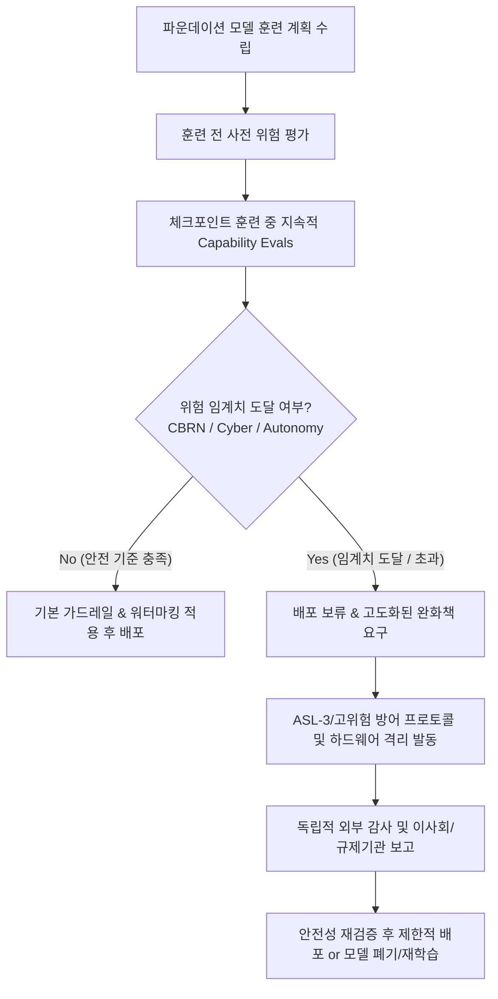

# Track 1: RSP (Responsible Scaling Policy) & Frontier AI Governance

> **프론티어 모델의 급격한 역량 확장에 따른 실존적·재앙적 위험을 통제하기 위한 자율 규제 및 거버넌스 프레임워크**

---

## 📌 트랙 개요
Track 1에서는 글로벌 주요 AI 랩(Anthropic, OpenAI, Google DeepMind)이 도입한 **책임 있는 확장 정책(RSP)**과 **글로벌 거버넌스 체계(EU AI Act 등)**를 다룹니다. 프론티어 파운데이션 모델은 학습 완료 전까지 발현될 역량(Emergent Reasoning Abilities)과 위험 수준을 정확히 예측하기 어렵습니다. 따라서 모델 역량 수준에 따라 사전 정의된 안전 조치와 보안 요구사항을 의무화하는 조건부 안전 공약(Conditional Commitments) 메커니즘을 분석합니다.

---

## 🎯 핵심 학습 목표
1. **ASL / CCL 체계 이해**: Anthropic의 ASL(AI Safety Level 1~4), OpenAI의 Risk Category Level(Low-Medium-High-Critical), DeepMind의 Critical Capability Levels(CCLs) 비교 분석.
2. **트리거 및 완화 조치 연동**: 특정 위험 역량(CBRN 조력, 사이버 무기화, 자율 복제)이 발현되는 임계치(Threshold)와 그에 따른 배포 중단 및 보안 상향 조치 메커니즘 파악.
3. **거버넌스 및 독립적 감사**: 내부 안전 위원회(Safety Advisory Committee), 이사회 보고 프로세스, 외부 평가 기관(US/UK AISI, METR)과의 협력 구조 이해.
4. **글로벌 법적 규제 준수**: EU AI Act의 고위험 범용 AI(GPAI) 분류 기준, 워터마킹 의무화 및 기술 문서 작성 요구사항 충족 방안.

---

## 📖 핵심 다이어그램: 프론티어 RSP 공통 의사결정 파이프라인

---

## 📚 주요 대상 문서 및 리소스

| 기관 / 주체 | 주요 문서명 | 핵심 분석 포인트 |
| :--- | :--- | :--- |
| **Anthropic** | Responsible Scaling Policy (v2/v3) | ASL-2 -> ASL-3 전환 조건, 모델 가중치 유출 방지 물리/사이버 보안, 내부 거버넌스 프로세스 |
| **OpenAI** | Preparedness Framework | 4대 위험 범주(CBRN, Cyber, Persuasion, Model Autonomy), 위험 지수 산출 및 배포 승인 기준 |
| **Google DeepMind** | Frontier Safety Framework | Critical Capability Levels (CCLs), 사전 예방 조치(Early Warning Signals), 프로토콜 실행 트리거 |
| **EU / International** | EU AI Act & AISI Standards | GPAI 모델 분류, 기계 판독 가능 워터마킹 의무화, 거버넌스 감사 요구사항 |

---

## 🇰🇷 한국 소버린 AI 개발팀 관점 시사점

1. **RSP의 경량화 적용 (Lightweight RSP)**
   - 수천억 원 규모의 전담 안전팀이 없는 중소·독자 모델 개발사는 **핵심 3대 영역(사이버 악용, 한국 특화 유해물 생성, API 악용)**에 집중된 간소화된 단계별 트리거(Tiered Safeguards) 체계를 수립해야 합니다.
2. **국내 인공지능기본법 및 컴플라이언스 대응**
   - 글로벌 프론티어 랩의 자율 규제(RSP) 방식을 선제적으로 차용함으로써 공공/엔터프라이즈 B2B 시장에서 높은 신뢰성과 규제 컴플라이언스 우위를 확보할 수 있습니다.
