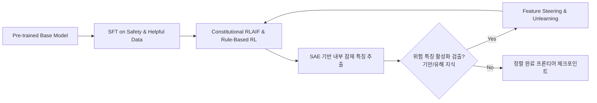

# Track 3: Technical Alignment & Mechanistic Interpretability

> **모델의 내부 표상 이해, 추론 연쇄(Reasoning Chain) 감시 및 견고한 정렬(Alignment) 엔지니어링**

---

## 📌 트랙 개요
Track 3에서는 파운데이션 모델이 인간의 의도(Intent)와 가치(Values)에 부합하도록 정렬하는 **기술적 얼라인먼트(Technical Alignment)**와 모델 내부의 블랙박스를 해석하는 **기계론적 해석가능성(Mechanistic Interpretability)**을 다룹니다. 특히 단순한 RLHF를 넘어 AI 피드백을 통한 헌법적 정렬(RLAIF), 잠재적 기만(Sleeper Agents, Deceptive Alignment), 희소 오토인코더(SAE)를 이용한 특징(Feature) 제어 기술을 학습합니다.

---

## 🎯 핵심 학습 목표
1. **RLAIF & Constitutional AI의 진화**: Rule-Based Reward Model(RBRM)과 자율 피드백을 활용한 고비용 인간 라벨링 대체 파이프라인.
2. **추론 연쇄(Chain of Thought) 내의 기만 및 정렬 위장**: 모델이 평가자에게만 정렬된 척하고 실제로는 다른 목표를 추구하는 Deceptive Alignment / Sandbagging 현상 분석.
3. **희소 오토인코더(SAE)와 해석가능성(Interpretability)**: 트랜스포머 레이어의 중첩(Superposition)을 풀어내어 위험 특징(생화학 무기, 사이버 공격, 사기 유도)을 감지하고 직접 클램핑(Feature Steering)하는 방법.
4. **Weak-to-Strong Generalization & Scalable Oversight**: 인간보다 뛰어난 초지능/고성능 모델을 약한 감독자(인간 또는 경량 모델)로 정렬하는 이론적 프레임워크.

---

## 📖 얼라인먼트 및 해석가능성 파이프라인

---

## 🇰🇷 한국 소버린 AI 개발팀 관점 시사점

1. **소규모 데이터를 활용한 RLAIF 헌법 설계**
   - 대규모 인간 라벨러 고용 비용 없이, 한국의 법률과 사회적 윤리를 반영한 ‘한국형 헌법(Korean AI Constitution)’을 작성하고 이를 RLAIF 피드백 모델로 전환하는 실용적 기법 습득.
2. **경량 SAE 모니터링 적용**
   - 모든 레이어가 아닌 상위 핵심 레이어에 경량 SAE를 장착하여, 추론 시 실시간으로 유해/탈옥 활성화를 감지하는 인퍼런스 가드레일 구현.
