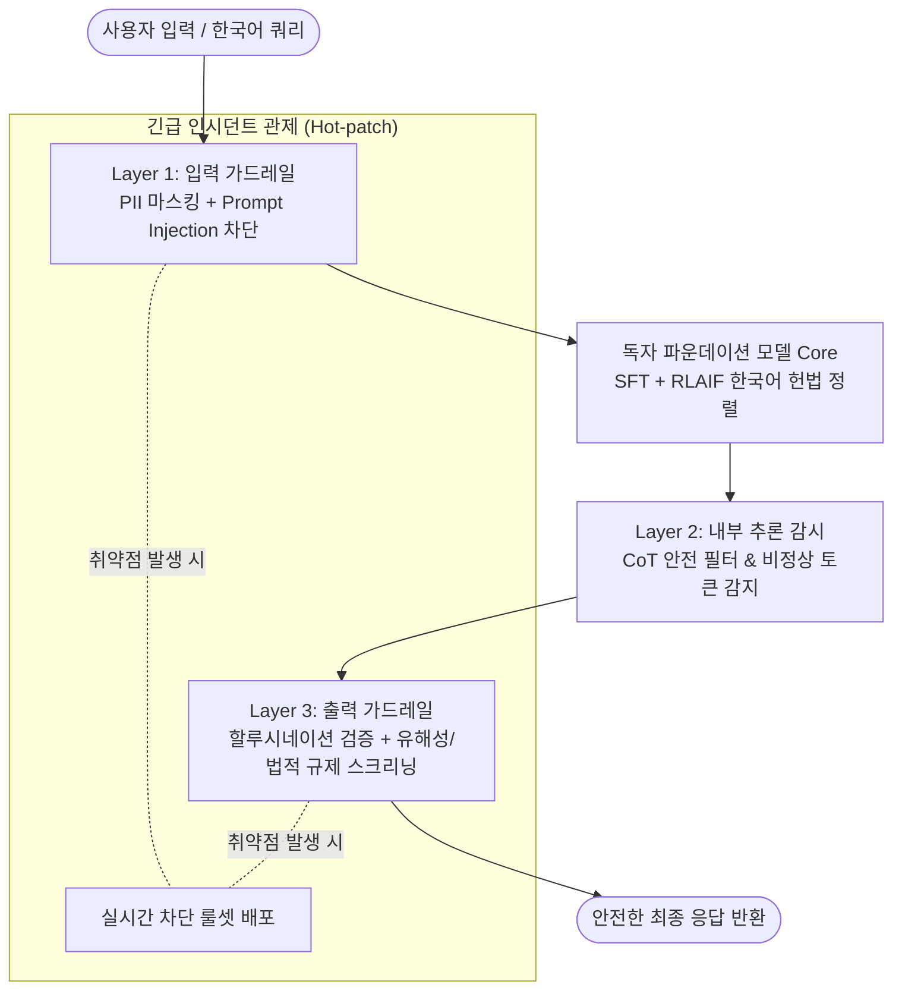

# Track 4: Sovereign AI & Practical Application for Independent Foundation Models

> **자체 파운데이션 모델을 구축·운영하는 기업 및 연구소를 위한 실전 안전 파이프라인 및 거버넌스 프레임워크**

---

## 📌 트랙 개요
Track 4에서는 한국을 비롯한 **소버린 AI(Sovereign AI)** 및 독자 파운데이션 모델 구축 팀이 직면하는 현실적인 제약(제한된 컴퓨팅/인력, 언어적·문화적 특수성, 국내 법제도) 속에서 최적의 안전 및 거버넌스 체계를 구축하는 실전 방법론을 다룹니다.

---

## 🎯 핵심 학습 목표
1. **비용 효율적인 경량 안전 파이프라인 (Cost-efficient Safety Pipeline)**:
   - 오픈소스 안전 모델(Llama Guard, NeMo Guardrails, ShieldGemma 등)을 조합한 3중 인퍼런스 방어벽 구축.
2. **한국어 및 국내 규제 특화 안전성 (Korean Specifics & Compliance)**:
   - 개인정보보호법, 공공기관 보안성 가이드라인, 인공지능기본법에 맞춘 프롬프트 필터링 및 비식별화 체계.
   - 다국어 번역 기반 탈옥(Cross-lingual Jailbreak) 및 한국 역사/정치적 논쟁 이슈에 대한 중립성 보장.
3. **인시던트 대응 및 모델 재조정 런북 (Incident Response & Patching Runbook)**:
   - Claude Fable, GPT-5.6 등의 선례와 같이, 배포 후 보안 취약점이 발견되었을 때 서비스 중단 최소화 및 긴급 회수/가드레일 재조정(Post-hoc Patching) 프로세스 구축.

---

## 📖 소버린 AI 3계층 방어 아키텍처

---

## 🇰🇷 실전 배포 체크리스트 (Sovereign AI Blueprint)

- [ ] **데이터셋 전처리**: 개인정보(주민번호, 전화번호, 계좌 등) 정규식 및 NER 기반 사전 비식별화 완료.
- [ ] **헌법적 정렬**: 한국 사회 가치관 및 현행법을 반영한 Harmlessness Constitution 작성 및 RLAIF 반영.
- [ ] **입/출력 가드레일**: 경량 분류기(Inference Classifier) 레이턴시 < 20ms 유지.
- [ ] **시스템 카드 발행**: 모델 스펙, 잔여 한계점, 안전성 평가 수치를 담은 투명성 문서 공개.
- [ ] **인시던트 런북**: 이상 징후 감지 시 10분 내 특정 기능/도메인 차단 가능한 피처 플래그 운영.
