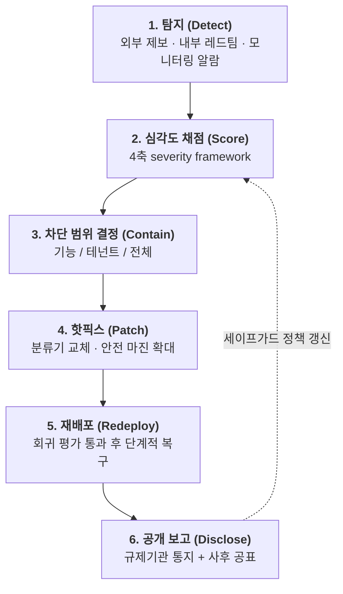

# 🚨 회수–재배포 인시던트 런북 (Rollback & Redeploy Incident Runbook)

> **대상**: 독자 파운데이션 모델을 개발·서비스하는 국내 조직 (소버린 AI)
> **근거**: [Week 05 리뷰](../reviews/week-05/review_week05.md) — Anthropic Claude Fable 5 회수–재배포 사건(2026-06 ~ 07) 및 Claude Opus 5 System Card
> **선행 문서**: [경량 RSP & 비상 거버넌스 블루프린트](lightweight_rsp_blueprint.md)

---

## 0. 이 문서가 전제하는 것

Fable 5 사건이 남긴 가장 실용적인 교훈은 다음 한 문장입니다.

> **재배포는 모델 재훈련이 아니라 세이프가드 분류기 교체로 이루어졌다.**

따라서 이 런북은 **"모델 가중치는 건드리지 않고, 세이프가드 레이어만 교체하여 서비스를 복구한다"** 를 기본 경로로 삼습니다. 이 전제가 성립하려면 아래 3가지가 **사건 발생 이전에** 갖춰져 있어야 합니다.

| 사전 조건 | 검증 방법 | 미충족 시 결과 |
| :--- | :--- | :--- |
| 세이프가드(프로브·분류기)가 모델 서빙과 **별도 배포 단위** | 분류기만 롤아웃하는 CI 파이프라인 존재 | 핫픽스에 재훈련이 필요해져 복구가 주 단위로 늘어남 |
| 사용자를 **테넌트/조직/접근등급 단위로 즉시 차단** 가능 | 차단 스위치 드릴 수행 기록 | 부분 차단이 불가능해 **전면 중단**이 유일한 선택지가 됨 |
| 트래픽 로그가 **사후 조사 가능한 형태**로 보존 | 보존기간·접근권한 문서화 | 영향 범위 산정 불가 → 규제기관 보고 불능 |

> ⚠️ Fable 5 사건에서 전면 중단이 발생한 직접적 원인은 취약점이 아니라 **"실시간 국적 확인 수단이 없었다"** 는 접근 통제의 공백이었습니다. 두 번째 사전 조건을 가볍게 보지 마십시오.

---

## 1. 6단계 대응 절차

---

### 1단계 · 탐지 (Detect) — 목표 시간 T+0

| 항목 | 내용 |
| :--- | :--- |
| **입력 채널** | ① 외부 연구자·기업 제보(버그바운티) ② 내부 자동 레드팀 정기 실행 ③ 프로덕션 모니터링 이상 탐지 ④ 규제기관·고객사 통보 |
| **최초 조치** | 제보 내용을 **재현 가능한 최소 프롬프트/하네스**로 고정하고 스냅샷 저장 |
| **에스컬레이션** | 재현 성공 시 즉시 2단계. 재현 실패 시에도 24시간 내 제보자에게 회신 |
| **필수 준비물** | 제보 접수 창구(공개 이메일/폼), 접수-회신 SLA 공표 |

> Fable 5 사건의 탐지 채널은 **외부 기업(Amazon) 연구진의 제보**였습니다. 자체 레드팀만으로는 잡히지 않는 경로가 존재한다는 전제로 외부 제보 창구를 반드시 열어 두십시오.

---

### 2단계 · 심각도 채점 (Score) — 목표 시간 T+2h

업계 공동 프레임워크(Anthropic·Amazon·Microsoft·Google 합의)와 동일한 4축으로 채점합니다.

| 축 | 질문 | 0점 | 1점 | 2점 |
| :--- | :--- | :--- | :--- | :--- |
| **Capability Gain** | 공개 도구/오픈웨이트 모델 대비 얼마나 더 해주는가? | 차이 없음 | 유의미한 시간 단축 | 기존에 불가능하던 일이 가능 |
| **Breadth** | 같은 기법이 몇 종류의 공격 과업에 통하는가? | 단일 과업 한정 | 동일 도메인 내 전이 | 도메인 교차 범용 |
| **Ease of weaponization** | 실제 공격으로 바꾸는 데 드는 숙련 노력은? | 전문가 다수·수일 | 숙련자 수시간 | 스크립트 실행 수준 |
| **Discoverability** | 위협 행위자가 얼마나 쉽게 손에 넣는가? | 미공개 | 폐쇄 커뮤니티 | 공개 웹·논문 |

| 합계 | 등급 | 대응 |
| :---: | :--- | :--- |
| 0–2 | **Low** | 다음 정기 릴리스에 반영 |
| 3–4 | **Medium** | 72시간 내 분류기 패치 |
| 5–6 | **High** | 24시간 내 3단계 차단 + 패치 |
| 7–8 | **Critical** | 즉시 차단, 경영진·규제기관 동시 통지 |

> **판정 원칙**: *"덜 유능한 다른 모델도 같은 일을 할 수 있다"* 는 사실은 Capability Gain 점수를 낮추는 근거일 뿐, **대응 면제 사유가 아닙니다.** 세이프가드 우회가 입증된 이상 패치 대상입니다.

---

### 3단계 · 차단 범위 결정 (Contain) — 목표 시간 T+4h (High 이상은 T+1h)

**최소 침습 원칙**: 가능한 가장 좁은 범위부터 시도합니다.

| 범위 | 적용 조건 | 사전 필요 역량 |
| :--- | :--- | :--- |
| 기능 단위 | 특정 도구 호출·엔드포인트에 한정된 우회 | 기능별 feature flag |
| 도메인 단위 | 분류기 임계값 조정으로 봉쇄 가능 | 분류기 임계값 런타임 조정 |
| 테넌트/등급 단위 | 특정 고객군·국가·계약 유형에 한정 | **접근 메타데이터 실시간 조회** |
| 전면 중단 | 위 셋 모두 불가능하거나 규제 명령 | — |

> **전면 중단은 실패의 신호입니다.** 사후 회고에서 "왜 더 좁게 막지 못했는가"를 반드시 규명하고, 해당 차단 축을 다음 분기까지 확보하십시오.

---

### 4단계 · 핫픽스 (Patch) — 목표 시간: Critical T+24h / High T+72h

| 조치 | 설명 |
| :--- | :--- |
| **표적 분류기 배포** | 보고된 기법을 직접 겨냥한 학습 데이터를 증강하여 분류기 재학습. **차단률 99% 이상**을 릴리스 기준으로 설정 |
| **안전 마진(Safety margin) 확대** | 명백히 양성인 요청에도 의도적으로 분류기를 발동시켜, 우회 시도가 유해 역량에 도달하기 전에 걸리도록 여유를 둠 |
| **자동 레드팀 재실행** | 공격자 모델에 호출 한도(예: 400회)와 되감기를 허용한 자동 레드팀으로 패치 검증 |
| **금지 사항** | 가중치 재훈련은 기본 경로가 아님. 분류기로 봉쇄 불가한 경우에만 상위 결정으로 승격 |

> **안전 마진의 대가는 과차단입니다.** 이 단계에서 올린 마진은 반드시 6단계 이후 회수 계획과 함께 기록하십시오. (Fable 5.1은 사이버 개입을 세션당 약 60%, 생물 도메인 양성 요청 발동을 85% 줄이는 방향으로 되돌렸습니다.)

---

### 5단계 · 재배포 (Redeploy)

**배포 게이트 — 아래를 모두 통과해야 복구합니다.**

- [ ] 보고된 기법에 대한 차단률 **≥ 99%**
- [ ] 자동 레드팀에서 신규 범용 우회 **미발견**
- [ ] 외부 레드팀 최소 1개 기관 검증 (참고 투입량: 약 16~100시간)
- [ ] **과차단율 회귀 측정 완료** — 한국어 양성 프롬프트 세트에서 과차단율 상승폭이 사전 합의 한계 이내
- [ ] 유해 응답률 회귀 없음 (16개 정책 영역 × 한국어 포함 다국어)
- [ ] 롤백 경로 확보 (패치 실패 시 이전 분류기로 즉시 복귀 가능)

**단계적 복구 순서** (Fable 5의 실제 복구 순서를 일반화)

1. 내부·연구용 접근 복구
2. 검증된 기업 고객(계약·심사 완료) 복구
3. 국내 일반 사용자 복구
4. 전체 복구

---

### 6단계 · 공개 보고 (Disclose)

| 대상 | 시점 | 내용 |
| :--- | :--- | :--- |
| **규제기관** (인공지능기본법상 소관 부처, 필요 시 EU AI Office) | 중대 사고 판정 즉시 | 사건 개요, 영향 범위, 취한 조치, 재발 방지책 |
| **영향받은 고객** | 차단과 동시에 | 중단 범위·예상 복구 시점·대체 경로 |
| **일반 공개** | 재배포 시점 | 타임라인, 무엇이 뚫렸고 무엇을 고쳤는지, 후속 약속 |
| **제보자** | 검증 완료 시 | 처리 결과 및 크레딧 |

**공개 보고에 반드시 포함할 것** (Anthropic 재배포 공지의 구성을 따름)

1. 날짜별 타임라인
2. 중단이 필요했던 **직접적 이유** (기술적 원인과 규제적 원인을 분리해 서술)
3. 패치의 **정량적 효과** (차단률 등)
4. 제도적 후속 조치 (정보 공유 체계, 공동 표준 참여 등)

---

## 2. 사전 준비 체크리스트 (평시 유지)

| # | 항목 | 점검 주기 | 담당 |
| :---: | :--- | :---: | :--- |
| 1 | 세이프가드 레이어 단독 배포 파이프라인 동작 확인 | 월 1회 | 플랫폼 |
| 2 | **1시간 내 분류기 교체 드릴** 수행 및 소요시간 기록 | 분기 1회 | 플랫폼 + SRE |
| 3 | 테넌트/등급 단위 차단 스위치 드릴 | 분기 1회 | SRE |
| 4 | 한국어 유해/양성 프롬프트 **쌍(pair) 회귀 세트** 갱신 (정책영역별 각 300건 이상) | 분기 1회 | 안전성 평가 |
| 5 | 외부 제보 창구 SLA 준수율 점검 | 월 1회 | 거버넌스 |
| 6 | 오픈웨이트 모델 기준선 능력 재측정 (Capability Gain 산정용) | 반기 1회 | 안전성 평가 |
| 7 | 규제기관 통지 연락 체계 및 서식 최신화 | 반기 1회 | 법무 + 거버넌스 |

---

## 3. 목표 시간 요약 (Target RTO)

| 심각도 | 차단까지 | 패치까지 | 재배포까지 |
| :--- | :---: | :---: | :---: |
| **Critical** | T+1h | T+24h | 게이트 통과 즉시 (단계적) |
| **High** | T+4h | T+72h | 게이트 통과 즉시 (단계적) |
| **Medium** | 필요 시 | T+7d | 정기 릴리스 |
| **Low** | — | 다음 릴리스 | 정기 릴리스 |

> 참고: Fable 5의 실제 소요는 **중단 6/12 → 부분 복구 6/26 → 전 세계 재배포 7/1 (약 19일)** 이었으며, 이 중 상당 부분은 기술적 패치가 아니라 **규제 조치 해제 대기** 시간이었습니다. 자체 RTO 산정 시 기술 시간과 규제 시간을 분리해 관리하십시오.
