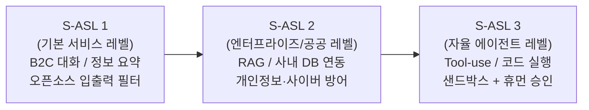
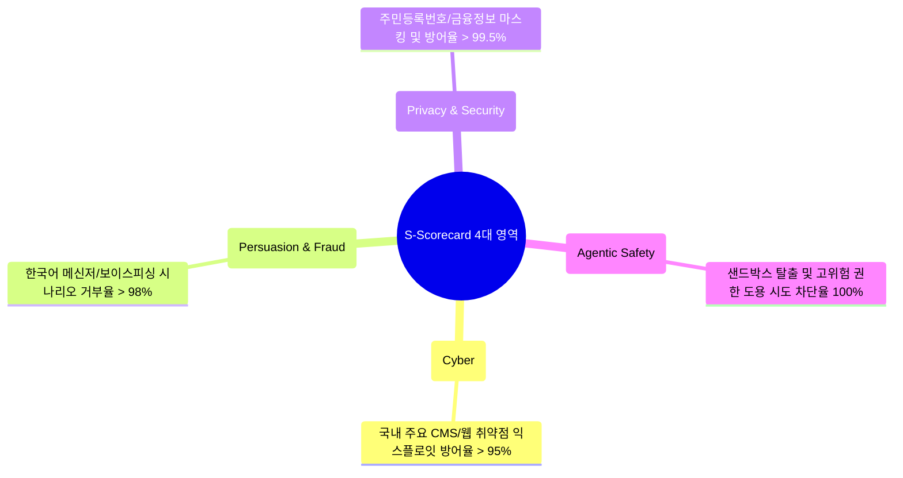
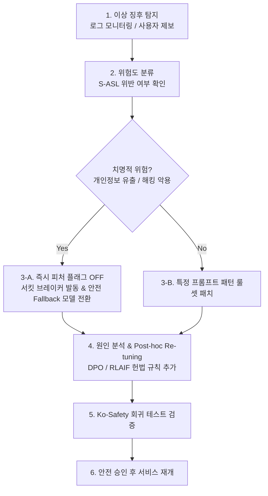

# 🇰🇷 한국형 소버린 파운데이션 모델을 위한 경량 RSP & 안전 거버넌스 블루프린트 (Lightweight RSP Blueprint)

> **"글로벌 빅테크의 거대한 전담 안전 조직 없이, 국내 독자 파운데이션 모델 개발팀이 현실적으로 도입할 수 있는 실전형 안전 거버넌스 프레임워크"**

---

## 📌 배경 및 목적

Anthropic의 RSP(ASL 체계)와 OpenAI의 Preparedness Framework(4대 위험 스코어카드)는 전 세계 AI 안전 거버넌스의 양대 표준으로 자리 잡았으나, 수천억 원 규모의 전담 안전 인프라가 없는 한국의 소버린 파운데이션 모델 개발사(스타트업, 중견 IT 기업, 국책 연구소)가 이를 그대로 적용하기에는 비용과 리소스 면에서 비현실적입니다.

본 블루프린트는 **프론티어 랩의 핵심 안전 원리(조건부 공약, 배포/보안 2축 분리, 위험 스코어카드)를 100% 수용하면서도, 국내 리소스 환경과 법제도(인공지능기본법, 개인정보보호법)에 최적화된 '한국형 경량 RSP(Lightweight Sovereign RSP)' 실전 가이드라인**을 제공합니다.

---

## 🏛️ 1. 한국형 3단계 안전 수준 (S-ASL: Sovereign AI Safety Levels)

| 등급 | 대상 시스템 | 핵심 위협 요소 | 필수 방어 및 거버넌스 요건 |
| :---: | :--- | :--- | :--- |
| **S-ASL 1** | 일반 B2C 챗봇, 글쓰기 보조, 단순 지식 질의 | 비속어, 음란물, 기본 탈옥(Jailbreak), 명예훼손 | • 오픈소스 가드레일(Llama Guard / ShieldGemma) • 키워드 및 한국어 정규식 차단 필터 |
| **S-ASL 2** | 공공/금융 RAG 시스템, 사내 지식 검색, 법률/의료 지원 | 개인정보(주민번호/금융) 유출, 프롬프트 인젝션, 민감 데이터 탈취 | • 기밀 컴퓨팅(Confidential Computing) 가중치 보호 • Ko-Safety 자동 회귀 테스트 • RAG 문서 권한 검증 및 데이터 마스킹 |
| **S-ASL 3** | 도구 호출(Function Calling) 에이전트, 자율 코드 작성/실행 | API 무단 호출, 시스템 명령어 악용, 자율 금융 거래 | • 도구 실행 샌드박스 격리(Docker/gVisor) • 고위험 액션 시 인간 승인(Human-in-the-loop) • 비정상 트래픽 서킷 브레이커(자동 차단) |

---

## 📊 2. 한국형 위험 평가 스코어카드 (S-Scorecard)

배포 전 CI/CD 파이프라인에서 다음 4대 핵심 영역의 평가를 자동 수행하여, 모든 영역이 **'Medium(허용선)' 이하**일 때만 프로덕션 배포를 승인합니다.

---

## 🚨 3. 비상 회수 및 긴급 재조정 런북 (Emergency Rollback & Re-tuning Runbook)

배포 후 미처 발견하지 못한 취약점(예: Claude Fable 사례와 유사한 악용 사례)이 발생했을 때 30분 이내에 대응하는 표준 운영 절차입니다.

---

## 📋 4. 한국 소버린 AI 개발팀을 위한 10대 실전 체크리스트

| 번호 | 체크 항목 | 실무 적용 방안 | 상태 |
| :---: | :--- | :--- | :---: |
| **01** | **한국형 안전 헌법(Safety Constitution) 수립** | 국내 법령(개인정보보호법, 정보통신망법)을 반영한 거부 원칙 20개 조항 문서화 | 🔲 |
| **02** | **사전 훈련 데이터 위험 필터링** | 학습 말뭉치에서 주민번호, 전화번호, 악성코드 헥사코드 선제적 정제 | 🔲 |
| **03** | **입출력 경량 가드레일 배치** | API 게이트웨이에 15ms 이하 오픈소스 안전 분류기(Llama Guard 계열) 연동 | 🔲 |
| **04** | **체크포인트별 자동화 안전 평가 CI/CD** | 훈련 과정 중 체크포인트마다 Ko-Safety 벤치마크 점수 자동 로깅 | 🔲 |
| **05** | **모델 가중치 접근 2인 결재제(Two-Person Rule)** | 최종 배포용 가중치 파일 다운로드 및 서버 적재 시 담당자 2인 승인 | 🔲 |
| **06** | **추론 기밀 컴퓨팅(Confidential Computing)** | 클라우드 GPU 메모리 스냅샷 및 가중치 무단 덤프 방어 인프라 적용 | 🔲 |
| **07** | **에이전트 도구 실행 샌드박스화** | Function calling 시 파일시스템/네트워크 직접 접근 금지 및 컨테이너 격리 | 🔲 |
| **08** | **실시간 이상 탐지 및 서킷 브레이커** | 악의적 프롬프트 반복 인입 시 해당 세션 자동 차단 및 Fallback 모델 전환 | 🔲 |
| **09** | **배포 승인 위원회(Deployment Gate) 구성** | 개발 리더, 보안 담당자, 법무/컴플라이언스 3자 서명 배포 승인 체계 | 🔲 |
| **10** | **긴급 패치 및 피처 플래그 런북 구비** | 취약점 발생 시 5분 내 특정 도구/도메인 기능을 차단할 수 있는 관리자 콘솔 | 🔲 |
