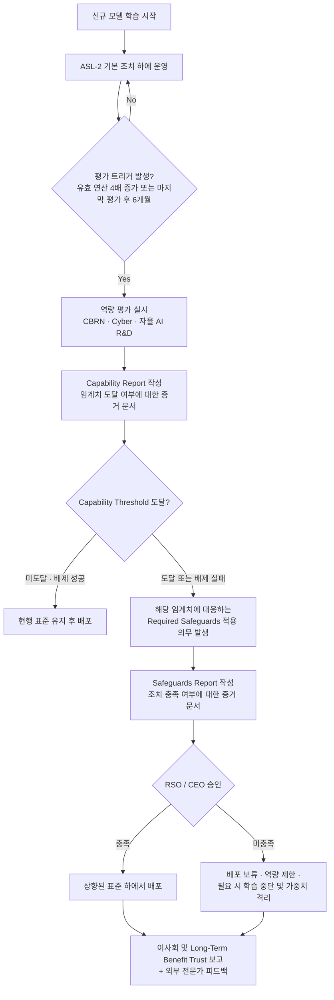
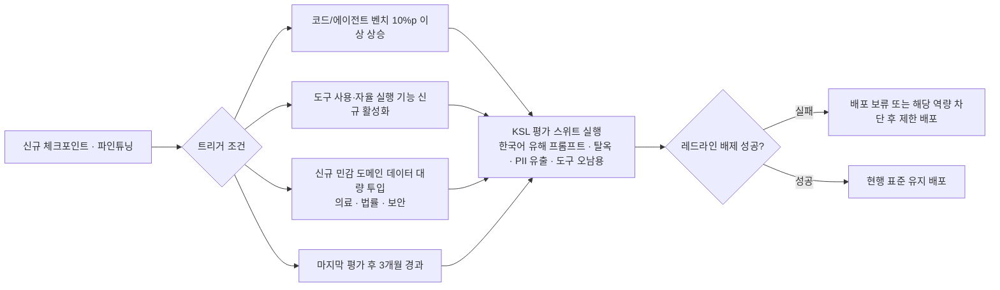

# [Week 02] Anthropic Responsible Scaling Policy (RSP) & ASL 프레임워크 심층 분석

- **리뷰 일자**: 2026-08-25 (월)
- **트랙/갈래**: Track 1 — RSP & Frontier Governance
- **난이도**: 🟡 중급
- **대상 문서 및 원문 링크**:
  - [Anthropic — Responsible Scaling Policy (원문 공지, v1)](https://www.anthropic.com/news/anthropics-responsible-scaling-policy)
  - [Anthropic — Responsible Scaling Policy v2 (개정 공지)](https://www.anthropic.com/news/responsible-scaling-policy-v2)
  - [Anthropic — Claude 5 Family System Card & Safety Addendum](https://www.anthropic.com/news/claude-5-family) *(보조 자료)*
  - 비교 자료: [OpenAI Preparedness Framework](https://openai.com/safety/preparedness/), [DeepMind Frontier Safety Framework](https://deepmind.google/discover/blog/introducing-the-frontier-safety-framework/)

> ⚠️ **정확성 주의**: 본 리뷰의 §2는 공개 원문(RSP v1/v2)에 근거해 정리했습니다. §3의 2026년 최신 개정분 및 Claude 5 라인업 관련 서술 중 `[원문 대조 필요]` 표기 항목은 리뷰 세션에서 최신 원문 PDF와 직접 대조 확인이 필요합니다.

---

## 1. 핵심 요약 (Executive Summary)

RSP는 "모델이 얼마나 위험한지 미리 알 수 없다"는 근본적 불확실성을 **조건부 공약(if-then commitments)** 으로 우회하는 장치입니다. 위험을 사전에 정량화해 규제하는 대신, *"모델이 특정 위험 역량 임계치에 도달했다는 증거가 나오면, 그 시점에 사전 약속된 보안·배포 표준을 충족하기 전까지 학습·배포를 진행하지 않는다"* 는 절차적 약속을 겁니다. 핵심 혁신은 **위험 판단(Capability Threshold)과 대응 조치(Required Safeguards)를 분리한 뒤 둘을 계약처럼 결합**한 데 있습니다. 이 분리 덕분에 새로운 위협 벡터가 등장해도 전체 프레임워크를 재설계하지 않고 임계치 목록만 확장할 수 있고, 반대로 방어 기술이 발전하면 안전조치 정의만 갱신할 수 있습니다.

- **핵심 목표**: 프론티어 모델의 재앙적 오용·통제 상실 위험을 **역량 수준(ASL)에 비례한 단계적 의무**로 통제하고, 그 판단·집행 책임을 조직 거버넌스(RSO·이사회)에 고정한다.
- **주요 제안/발견**:
  1. ASL은 "모델의 등급"이 아니라 **모델에 적용되어야 하는 안전 표준의 등급**이다. (모델을 ASL-3로 다룬다 = ASL-3 표준을 적용해 운영한다는 뜻)
  2. v2 개정의 본질은 임계치 개수 확대가 아니라 **판단 절차의 문서화**(Capability Report / Safeguards Report)와 **책임자 지정**(Responsible Scaling Officer)이다.
  3. 안전조치는 반드시 **배포 표준(Deployment Standard)** 과 **보안 표준(Security Standard)** 의 두 축으로 쪼개진다. 오용 방어(밖에서 들어오는 공격)와 가중치 탈취 방어(밖으로 나가는 유출)는 완전히 다른 공학 문제이기 때문이다.
- **핵심 키워드**: `#RSP` `#ASL` `#CapabilityThreshold` `#IfThenCommitment` `#WeightSecurity` `#ResponsibleScalingOfficer`

---

## 2. 세부 내용 분석 (In-depth Technical Analysis)

### 2.1 주요 프레임워크 / 위험 평가 지표

#### (1) ASL 계층 구조

| 레벨 | 정의 | 요구 조치의 성격 |
| :--- | :--- | :--- |
| **ASL-1** | 유의미한 재앙적 위험이 없는 시스템 (예: 체스 엔진, 소형 구형 모델) | 별도 조치 불필요 |
| **ASL-2** | 위험 정보를 일부 제공할 수 있으나, 검색엔진/교과서 대비 **유의미한 증분 위험(uplift)이 없는** 수준 | 기본선(baseline): 유해 요청 거부 학습, 모델 카드 공개, 취약점 신고 창구, 표준적 보안 위생 |
| **ASL-3** | 비전문가 공격자에게 **실질적 증분 역량을 제공**하거나, 낮은 수준의 자율 역량을 보이는 수준 | 강화된 배포 방어 + 비국가 행위자(non-state attacker)의 가중치 탈취를 막는 보안 |
| **ASL-4 이상** | 국가 안보급 위협 또는 자율적 AI R&D 가속을 통해 통제 곤란을 유발할 수 있는 수준 | 국가급 공격자 방어 보안, 정성적 안전 논증(safety case) 요구 |

> **핵심 해석**: ASL은 누적적(cumulative)입니다. ASL-3 모델은 ASL-2 조치를 모두 포함한 위에 추가 표준을 얹습니다. 또한 "모델의 등급"이 아니라 **운영 표준의 등급**이므로, 동일 모델이라도 배포 형태(내부 전용 / API / 오픈 가중치)에 따라 요구 표준이 달라집니다.

#### (2) v2의 구조적 재편: 임계치와 조치의 분리

**설계상 가장 중요한 지점은 F 노드의 판정 방향입니다.** RSP는 "위험하다는 증거가 나오면 조치한다"가 아니라 **"위험하지 않다는 것을 배제(rule out)하지 못하면 위험한 것으로 간주한다"** 는 입증 책임 전환을 채택합니다. 즉 불확실성이 안전 쪽으로 기울도록 기본값이 설정되어 있습니다. 이것이 여타 자율규제 문서와 RSP를 가르는 실질적 차이입니다.

#### (3) 추적 대상 역량 임계치 (Capability Thresholds)

| 위협 벡터 | 임계치의 실질 정의 | 요구 표준 |
| :--- | :--- | :--- |
| **CBRN (생화학·핵·방사능)** | 자원이 제한된 비국가 행위자가 실제로 대량살상 무기를 획득·제조하는 데 **의미 있는 조력**을 제공 | ASL-3 배포 + ASL-3 보안 |
| **CBRN 상위 단계** | 국가급 프로그램 수준의 조력 또는 능력의 대폭 확장 | ASL-4급 보안(국가 행위자 방어) |
| **자율 AI R&D (하위)** | AI 연구자 업무의 상당 부분을 자율 수행하여 **연구 속도를 비선형적으로 가속** | 상향된 보안 + 내부 사용 통제 |
| **자율 AI R&D (상위)** | 통제 곤란한 재귀적 역량 향상 루프를 촉발할 수 있는 수준 | 최고 수준 보안 + 정성적 safety case |
| **사이버 공세(Cyberoffensive)** | 대규모 인프라를 겨냥한 공격 작전을 실질적으로 증분 강화 | 별도 추적 및 사례별 대응 |

**주목할 점**: 임계치가 "벤치마크 점수 N점"이 아니라 **"실제 위협 시나리오에서 인간 공격자 대비 증분 효과(uplift)"** 로 정의된다는 것입니다. 벤치마크는 임계치 자체가 아니라 임계치 판단의 **입력 증거**일 뿐입니다. 이 구분을 놓치면 "MMLU 몇 점 이상은 위험" 류의 무의미한 지표 거버넌스로 퇴화합니다.

### 2.2 완화 조치 (Mitigations) 및 얼라인먼트 기법

RSP의 안전조치는 반드시 **두 축**으로 분리됩니다.

#### (A) 배포 표준 (Deployment Standard) — "오용을 막는다"
- **다층 방어(defense in depth)**: 학습 단계 정렬(Constitutional AI / RLAIF) → 실시간 입출력 분류기(constitutional classifiers) → 오프라인 오용 탐지 → 계정·세션 차단 및 접근 등급화.
- **탈옥 대응 루프**: 범용 탈옥(universal jailbreak)에 대한 **버그 바운티 운영 + 신속 패치 SLA**. 단일 필터의 완전성을 가정하지 않고 "뚫린다"를 전제로, 탐지-패치 회전율 자체를 방어력으로 삼는 설계.
- **역량 제한(capability restriction)**: 임계치를 넘긴 특정 도메인에 한해 응답 역량을 제거·거부하여 모델 전체 배포는 유지하는 부분 완화 옵션.

#### (B) 보안 표준 (Security Standard) — "가중치를 지킨다"
- ASL-3 보안의 위협 모델은 **비국가 행위자(정교한 범죄조직·내부자)** 입니다. 국가급 공격자 방어는 상위 레벨의 몫으로 명시적으로 유예됩니다 — 즉 **방어 대상 위협을 솔직하게 한정**하는 것이 이 문서의 특징입니다.
- 대표 통제: 가중치 접근에 대한 **2인 통제(two-party control)**, 접근 권한 최소화 및 상시 재인증, 이그레스 대역폭 제한·모니터링, 하드웨어/신뢰 실행 환경 격리, 내부자 위협 프로그램, 독립 레드팀 침투 검증.
- **핵심 통찰**: 아무리 정교한 배포 가드레일도 가중치가 유출되면 파인튜닝 몇 시간으로 무력화됩니다. 따라서 정렬(alignment)과 가중치 보안은 대체재가 아니라 **직렬로 연결된 필수 조건**입니다.

#### (C) 거버넌스 조치 — "누가 책임지는가"
- **Responsible Scaling Officer(RSO)**: 임계치 판정과 배포 승인에 대한 단일 책임자를 지정. 안전 판단이 제품 조직의 일정 압박에 종속되지 않도록 보고 라인을 분리.
- **이중 문서화**: Capability Report(위험이 있는가) / Safeguards Report(대비되었는가)를 분리 작성 — 두 질문을 한 문서에 섞으면 "조치가 있으니 위험이 없다"는 순환 논증이 발생하기 때문.
- **비순응 보고(non-compliance reporting)**: 내부 구성원이 RSP 위반을 익명 신고할 수 있는 채널과 비보복 원칙.
- **외부 검증**: 이사회 및 Long-Term Benefit Trust 보고, 외부 전문가·AISI·METR 등 제3자 평가 협력.

---

## 3. 최근 동향 및 진화 과정 (Recent Evolution & Context)

### 3.1 v1 → v2 → 현재

| 구분 | v1 (2023) | v2 (2024 개정) | 현재(2026) 관찰점 |
| :--- | :--- | :--- | :--- |
| 위험 정의 | ASL 레벨에 역량·조치가 혼재 | **Capability Threshold ↔ Required Safeguards 분리** | 임계치 목록이 자율 AI R&D 중심으로 확장 `[원문 대조 필요]` |
| 판단 절차 | 서술적 | Capability / Safeguards Report **문서 의무화** | 문서의 외부 요약 공개 관행 정착 |
| 책임 소재 | 불명확 | **RSO 지정 + 이사회 보고 명문화** | 규제기관 보고와 연동 |
| 평가 주기 | 임의 | **유효 연산 4배 또는 6개월** 트리거 | 상시 체크포인트 평가로 전환 추세 |
| 실집행 | 미발동 | — | **ASL-3 표준이 실제 상용 모델에 적용된 첫 사례 등장** (2025, Claude Opus 4 계열) |

**가장 중요한 사건은 "실제 발동"입니다.** 자율규제 프레임워크는 한 번도 발동되지 않으면 홍보 문서와 구분되지 않습니다. 임계치 도달을 배제하지 못했다는 이유만으로 실제 상용 모델에 상향된 보안·배포 표준을 적용한 사례가 나옴으로써 RSP는 **"실제로 쓰이는 절차"** 임이 입증되었습니다. 동시에 이는 *예방적 적용(precautionary application)* — 위험이 확증되어서가 아니라 배제에 실패해서 적용 — 이라는 운영 방식을 보여줍니다.

### 3.2 3대 랩 프레임워크 비교

| 항목 | Anthropic RSP | OpenAI Preparedness Framework | DeepMind Frontier Safety Framework |
| :--- | :--- | :--- | :--- |
| 위험 계층 | ASL-1~4 (조치 표준의 등급) | 위험 범주별 Low/Medium/High/Critical (역량의 등급) | Critical Capability Levels (역량의 등급) |
| 배포 기준 | 임계치 도달 시 **상향 표준 충족 전까지 배포 금지** | High 이하만 배포, Critical은 개발 자체 제한 | CCL 도달 시 대응 계획(Response Plan) 발동 |
| 입증 방향 | **위험 배제 실패 시 위험으로 간주**(보수적 기본값) | 평가 결과에 따른 등급 산정 | 조기 경보 신호(Early Warning) 기반 |
| 가중치 보안 | **독립된 Security Standard로 명시적 분리** | 보안 요구 포함하나 분리도가 낮음 | 보안 완화조치 레벨 정의 |
| 책임 구조 | RSO + 이사회 + LTBT | 안전자문그룹 + 리더십 + 이사회 | 내부 거버넌스 검토 |

> **벤치마킹 결론**: 소버린 AI 개발사가 참고하기에 이식성이 가장 높은 것은 **RSP의 "입증 책임 전환"과 "배포/보안 표준 2축 분리"** 이고, 가장 낮은 것은 **연산량 기반 평가 트리거(4배 룰)** 입니다. 후자는 프론티어 규모의 사전학습을 전제로 하기 때문입니다.

---

## 4. 🇰🇷 한국 독자 파운데이션 모델(Sovereign AI) 개발 관점 시사점

> **"글로벌 리딩 모델은 아니지만, 독자적인 모델을 개발하고 서비스해야 하는 입장에서의 실전 적용점"**

### 4.1 리소스 및 인프라 현실성 (Cost & Feasibility)

RSP를 그대로 이식하면 실패합니다. 전담 평가 조직, 자체 CBRN 도메인 전문가, 국가급 위협 대응 보안 예산을 전제하기 때문입니다. **버릴 것과 남길 것을 명확히 구분해야 합니다.**

| 요소 | 이식 판단 | 근거 |
| :--- | :--- | :--- |
| 입증 책임 전환(배제 실패 = 위험) | ✅ **그대로 채택** | 비용이 들지 않는 순수 정책 결정. 가성비가 가장 높은 항목 |
| 배포 표준 / 보안 표준 2축 분리 | ✅ **그대로 채택** | 조직이 작을수록 두 문제를 혼동하기 쉬움. 문서 분리만으로 효과 발생 |
| Capability / Safeguards Report 분리 | ✅ **경량화 채택** | A4 2매 수준 체크리스트로 축약 가능 |
| RSO 지정 | ✅ **겸직으로 채택** | 전담 인력 불필요. 단, **제품 조직장이 겸직하면 무의미** — 보고 라인 독립성이 본질 |
| CBRN 자체 평가 | ⚠️ **외부 위탁 / 축소** | 국내 단독 수행 비현실적. 공개 벤치마크 + 학계 협력으로 대체 |
| 유효 연산 4배 트리거 | ❌ **대체 필요** | 프론티어 규모를 전제. → **역량 벤치마크 델타 트리거**로 치환(아래) |
| 국가급 공격자 방어 보안 | ❌ **범위 밖** | 위협 모델을 "내부자 + 범죄조직"으로 솔직하게 한정하고 문서에 명시 |

**대체 트리거 제안 (KSL: Korean Safety Level)** — 연산량 대신 **관측 가능한 역량 변화량**을 트리거로 사용합니다.

- 평가 하네스는 **UK AISI `Inspect`** 를 채택해 자체 개발 비용을 제거하고, 1차 필터는 **Llama Guard / ShieldGemma** 계열 오픈 안전 모델로 구성합니다.
- 전체 파이프라인을 CI에 물려 **"평가 미통과 시 모델 아티팩트 승격 불가"** 를 기술적으로 강제합니다. 사람의 판단에만 의존하는 게이트는 일정 압박에 반드시 무너집니다.

### 4.2 한국어 및 로컬 맥락 특수성 (Cultural, Linguistic & Legal Specifics)

- **임계치의 현지화**: 한국 서비스 환경에서 실질적 재앙 위험은 CBRN보다 **(a) 자동화된 금융사기·보이스피싱 스크립트 생성, (b) 딥페이크·불법합성물, (c) 주민등록번호 등 PII 유출 및 재식별, (d) 공공 인프라 대상 사이버 악용** 쪽에 집중됩니다. 프론티어 랩의 임계치 목록을 복사하지 말고 **국내 위협 지형에 맞춰 재작성**해야 합니다.
- **교차언어 탈옥(Cross-lingual Jailbreak)**: 영어 기준으로 정렬된 거부 행동이 한국어 은어·초성체·방언·로마자 변환·한자 혼용 질의에서 붕괴하는 문제. 평가 스위트에 **동일 유해 의도의 다국어/변형 표기 페어**를 필수 포함합니다.
- **법제도**: 「인공지능 발전과 신뢰 기반 조성 등에 관한 기본법」(AI 기본법, 2025. 1. 21. 공포 / 2026. 1. 22. 시행)의 **고영향 AI 사업자 의무 및 생성형 AI 표시 의무**가 이미 발효 중입니다. RSP식 문서화(Capability / Safeguards Report)는 이 법의 **위험관리·설명 의무 이행 증빙과 그대로 매핑**되므로, 규제 대응 문서를 별도로 만들지 말고 **하나의 산출물로 통합**하는 것이 가장 비용 효율적입니다. 개인정보보호법(가명처리·재식별 금지), 저작권 이슈도 동일 문서 체계에 편입합니다.

### 4.3 우리 팀이 당장 적용할 Action Item (Top 3)

1. **[단기/즉시] `SAFETY_POLICY.md` v0.1 — 경량 RSP 1페이지 초안 확정**
   - 필수 4요소만 담습니다: ① 국내 위협 지형 기반 레드라인 5개, ② 평가 트리거 조건(§4.1), ③ 레드라인별 요구 조치(배포/보안 2축), ④ 승인 책임자(제품 조직 외부의 겸직 RSO).
   - *산출물*: 저장소 루트 커밋 + 릴리스 체크리스트에서 링크.
2. **[중기/모델 학습 단계] KSL 평가 스위트 v1 구축 및 CI 게이트화**
   - `Inspect` 기반 하네스 + 한국어 유해 프롬프트 / 교차언어 변형 / PII 유출 / 도구 오남용 4개 태스크셋.
   - *성공 기준*: 체크포인트 승격 파이프라인에서 자동 실행되며, 레드라인 태스크 실패 시 **머지 차단**.
3. **[배포/운영 단계] 가중치 보안 최소 표준 + 인시던트 런북**
   - 가중치 저장소 2인 승인, 접근 로그 상시 보존, 이그레스 모니터링(= ASL-3 보안의 최소 이식분).
   - 탈옥 제보 창구 + **패치 SLA(치명 24시간 / 일반 7일)**, 5분 내 기능 차단이 가능한 피처 플래그. Week 01 액션 3번의 연장선.

---

## 5. 논의할 질문 (Discussion Questions & Open Issues)

- **Q1.** RSP는 자율규제다. 상업적 압박과 충돌할 때 "배포 보류"가 실제로 집행되게 만드는 것은 문서인가, 거버넌스 구조(RSO·이사회·LTBT)인가? 국내 기업이 후자 없이 문서만 도입하면 어떤 실패 양상이 나타나는가?
- **Q2.** "위험을 배제하지 못하면 위험으로 간주한다"는 보수적 기본값은, 평가 역량이 약한 조직일수록 **모든 것이 임계치 도달로 판정되는** 역설을 낳는다. 평가 신뢰도가 낮은 상태에서 이 원칙을 어떻게 운용해야 하는가?
- **Q3.** 오픈 가중치 배포 시 배포 표준(Deployment Standard)은 원리적으로 무력화된다. 소버린 AI의 정책 목표(개방·확산)와 RSP식 통제는 양립 가능한가, 아니면 오픈 배포 모델은 **애초에 임계치 미도달 구간에서만 허용**해야 하는가?
- **Q4.** AI 기본법의 고영향 AI 의무와 RSP식 자율규제 문서를 하나로 통합할 때, 규제기관 제출용 문서와 내부 판단용 문서의 상세도 차이를 어떻게 관리할 것인가? (내부 문서의 솔직함이 규제 리스크가 되는 역인센티브 문제)

---

## 6. 참고 문헌 및 추가 리소스

- Anthropic. *Anthropic's Responsible Scaling Policy* (v1, 2023) — https://www.anthropic.com/news/anthropics-responsible-scaling-policy
- Anthropic. *Responsible Scaling Policy (v2 개정)* — https://www.anthropic.com/news/responsible-scaling-policy-v2
- Anthropic. *Claude 5 Family System Card & Safety Addendum* (2026) — https://www.anthropic.com/news/claude-5-family
- OpenAI. *Preparedness Framework* — https://openai.com/safety/preparedness/
- Google DeepMind. *Frontier Safety Framework* — https://deepmind.google/discover/blog/introducing-the-frontier-safety-framework/
- UK AISI. *Inspect — Evaluation Framework* — https://inspect.ai-safety-institute.org.uk/
- 과학기술정보통신부. 「인공지능 발전과 신뢰 기반 조성 등에 관한 기본법」(2025. 1. 21. 공포 / 2026. 1. 22. 시행)
- 관련 리뷰: [Week 01 — AI 위험 지형도](../week-01/review_week01.md)
