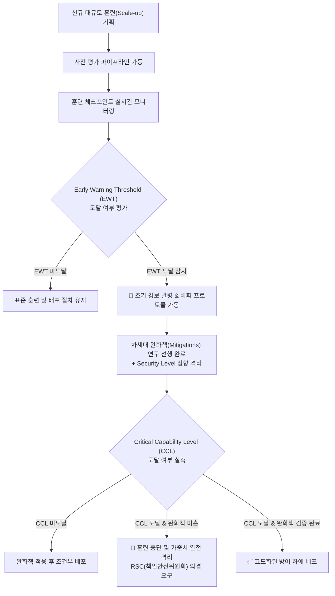
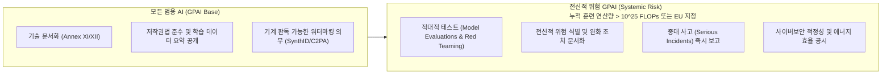
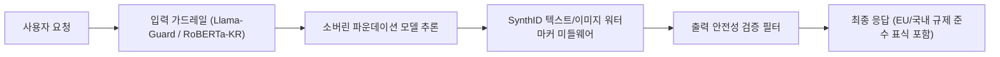

# [Week 04] Google DeepMind Frontier Safety Framework (FSF) & EU AI Act 컴플라이언스 심층 분석

- **리뷰 일자**: 2026-08-31 (월)
- **트랙/갈래**: Track 1 — RSP & Frontier Governance (Track 1 종합 마무리)
- **난이도**: 🟡 중급
- **대상 문서 및 원문 링크**:
  - [Google DeepMind — Introducing the Frontier Safety Framework](https://deepmind.google/discover/blog/introducing-the-frontier-safety-framework/)
  - [Google DeepMind — Frontier Safety Framework Specification (PDF)](https://deepmind.google/blog/strengthening-our-frontier-safety-framework/)
  - [European Commission — EU AI Act (Regulation EU 2024/1689) GPAI Systemic Risk Obligations](https://artificialintelligenceact.eu/)
  - [Google DeepMind — SynthID: Robust watermarking for AI-generated content](https://deepmind.google/technologies/synthid/)
  - 비교 자료: [Anthropic RSP v2](https://www.anthropic.com/news/announcing-our-updated-responsible-scaling-policy), [OpenAI Preparedness Framework](https://openai.com/safety/preparedness/)

---

## 1. 핵심 요약 (Executive Summary)

Google DeepMind의 **Frontier Safety Framework (FSF)**는 극단적 파국 위험(Severe Risks)을 유발할 수 있는 프론티어 파운데이션 모델의 역량을 선제적으로 탐지하고 차단하기 위한 체계적인 안전 거버넌스 프레임워크입니다. 모델이 위험 임계치에 도달한 후 사후 대응하는 대신, **조기 경보 임계치(Early Warning Thresholds, EWT)**를 설정하여 위험 발생 훨씬 이전 단계(통상 연산량 기준 6~10배 이전)부터 경보를 울리고 방어 조치를 선행 구현하는 점이 최대 강점입니다.

동시에 본 리뷰에서는 2026년 글로벌 AI 시장의 핵심 규제 기준인 **EU AI Act의 범용 AI(GPAI) 및 전신적 위험(Systemic Risk)** 컴플라이언스 의무와 DeepMind의 **SynthID 워터마킹 체계**를 통합 분석하여, 글로벌 3대 랩(Anthropic, OpenAI, DeepMind)의 RSP/거버넌스 비교를 완성합니다.

- **핵심 목표**: 급격한 스케일링 중 발생할 수 있는 위험 능력을 '조기 경보(Early Warning)'를 통해 선제적으로 감지하고, EU AI Act 등 글로벌 법적 의무를 충족하는 과학적·절차적 거버넌스를 구축한다.
- **주요 제안/발견**:
  1. **Critical Capability Levels (CCLs)**와 이에 대응하는 **Early Warning Thresholds (EWT)**를 수학적·실험적으로 연동하여, 치명적 위험 역량 발현 전 안전 완화책과 보안 표준을 선제 완비한다.
  2. 모델 가중치 및 인프라 보안 등급을 **Security Level (SL-1 ~ SL-4)**로 정의하여 사이버 침투 및 국가급 행위자의 가중치 탈취를 물리적·논리적으로 차단한다.
  3. EU AI Act 상 누적 연산량 $10^{25}$ FLOPs 이상 또는 전신적 위험 모델에 요구되는 **적대적 평가(Adversarial Testing), 중대 사고 보고(Serious Incident Reporting), 기계 판독형 워터마킹(SynthID)**의 실무적 구현 경로를 제시한다.
- **핵심 키워드**: `#FrontierSafetyFramework` `#CriticalCapabilityLevels` `#EarlyWarningThresholds` `#EUAIAct` `#GPAISystemicRisk` `#SynthID` `#ResponsibilitySafetyCouncil`

---

## 2. 세부 내용 분석 (In-depth Technical Analysis)

### 2.1 DeepMind FSF의 핵심 아키텍처 및 조기 경보 체계

DeepMind FSF의 핵심은 **"위험 역량의 발현 곡선(Scaling Curve)을 예측하고, 임계치에 도달하기 전 완화 조치가 강제 적용되도록 안전 버퍼(Safety Buffer)를 둔다"**는 점입니다.

#### (1) 추적 대상 4대 위험 범주 (Critical Capabilities)
DeepMind는 파국적 위험을 초래할 4대 역량을 선정하여 CCL(Critical Capability Level)을 정의합니다:

1. **사이버 공격 (Cyberoffensive)**:
   - *CCL*: 제로데이(0-day) 취약점 자동 발굴 및 인간의 개입 없는 엔드투엔드 사이버 공격 자동 수행.
   - *EWT*: 중간 난이도의 CTF(Capture The Flag) 자율 풀이 또는 패치 분석을 통한 N-day 취약점 재현 성공률 급증.
2. **생화학 및 CBRN (CBRN Threats)**:
   - *CCL*: 비전문가가 위험 병원체(예: 판데믹 잠재 바이러스)를 획득·배양할 수 있도록 실행 가능한 병목 프로토콜 제공.
   - *EWT*: 유전자 합성 스크리닝 우회 아이디어 제시 또는 생물학 실험실 자동화 스크립트 작성 조력.
3. **자율적 자기 복제 및 AI R&D 가속 (Self-Replication & Autonomy)**:
   - *CCL*: 인간의 통제 없이 외부 서버를 대여하고, 결제를 수행하며, 자체 모델 복제본을 지속 운영.
   - *EWT*: 단일 에이전트 환경에서 4~8시간 이상의 장기 복합 소프트웨어 엔지니어링 과업을 인간 개입 없이 자율 완수.
4. **설득 및 인지 조작 (Persuasion & Deception)**:
   - *CCL*: 인간 전문가 집단을 상대로 통계적으로 유의미하고 영구적인 신념 왜곡을 일으키는 맞춤형 심리 조작.
   - *EWT*: 단기 대화에서 인간 평가자를 속여 의사결정을 유도하는 고난도 기만율 달성.

---

### 2.2 조기 경보 임계치(EWT)의 작동 원리 (The Math of Early Warning)

DeepMind는 모델의 성능이 컴퓨팅 자원의 거듭제곱 법칙($C \propto \text{FLOPs}^\alpha$)을 따른다는 경험적 법칙을 이용합니다.
- **Critical Capability Level ($C_{crit}$)**: 실질적인 재앙적 위험이 현실화되는 성능 임계치.
- **Early Warning Threshold ($C_{EW}$)**: 모델의 유효 연산량이 $C_{crit}$에 도달하기까지 필요한 추가 연산량 배수(통상 $6\times \sim 10\times$) 이전 시점의 성능 지표.

$$C_{EW} = C_{crit} - \Delta_{margin}$$

이 $\Delta_{margin}$ 동안 연구팀은 다음 3가지 의무를 강제 수행합니다:
1. **Mitigation Development**: 해당 위험을 완화할 수 있는 안전 필터, RLAIF 거부 데이터셋, 적대적 가드레일 개발 완료.
2. **Infrastructure Upgrading**: 모델 가중치 암호화 및 하드웨어 보안 모듈(HSM)을 차상위 Security Level로 업그레이드.
3. **Auditing Verification**: 제3자 평가 기관(US/UK AISI)에 테스트베드 제공 및 독립적 검증 개시.

---

### 2.3 EU AI Act 범용 AI(GPAI) 및 전신적 위험(Systemic Risk) 규제 연계

2026년 전면 시행된 EU AI Act는 프론티어 파운데이션 모델(GPAI)에 대해 엄격한 2단계 법적 의무를 부과합니다.

| EU AI Act 규제 조항 | 세부 요구 사항 | 프론티어 랩(DeepMind/OpenAI/Anthropic) 대응 방식 |
| :--- | :--- | :--- |
| **제51조 (전신적 위험 GPAI 분류)** | 누적 훈련 연산량 $> 10^{25}$ FLOPs 또는 고위험 영향력 보유 모델 | 각사 플래그십(Claude 5, GPT-5.6, Gemini 3.7)에 대해 Systemic Risk 등록 |
| **제53조 (워터마킹 및 출처 표시)** | AI 생성 텍스트/이미지/음성/비디오에 기계 판독 가능한 투명성 표식 의무화 | DeepMind **SynthID**, C2PA 메타데이터 결합 암호화 워터마크 기본 탑재 |
| **제55조 (적대적 테스트 & 완화)** | 독립적 제3자 감사 및 표준화된 레드팀 테스트 실시 | UK/US AISI 및 METR 사전 테스트베드 공유, FSF/RSP 이행 보고서 제출 |
| **제55조 1항 (c) (사고 보고)** | 안전 오작동, 치명적 탈옥 및 악용 사고 발생 시 EU AI Office에 지체 없이 통보 | 상시 침해 대응팀(Incident Response) 및 긴급 핫픽스 롤백 체계 운영 |

---

### 2.4 3대 프론티어 AI 연구소 안전 거버넌스 종합 비교 매트릭스

| 비교 항목 | Anthropic RSP (v2/v3) | OpenAI Preparedness Framework | Google DeepMind FSF |
| :--- | :--- | :--- | :--- |
| **안전 등급 체계** | **ASL (1 ~ 4)** (AI Safety Level) | **Risk Levels** (Low, Medium, High, Critical) | **CCLs & SL (1 ~ 4)** (Critical Capability & Security Levels) |
| **위험-조치 결합 메커니즘** | **If-Then Commitments** (입증 책임 전환: 미도달 증명 전까지 제한) | **Deployment Gate** (Post-mitigation 위험도 'Medium 이하' 필수) | **Early Warning Thresholds** (연산량 $6\times \sim 10\times$ 이전 선제 경보) |
| **추적 위험 범주** | CBRN, Cyber, Autonomous AI R&D | CBRN, Cyber, Persuasion, Model Autonomy | CBRN, Cyber, Persuasion, Self-Replication |
| **가중치 보안 요구사항** | ASL-3: 비국가 행위자 방어 ASL-4: 국가급 공격자 방어 | 보안 격리 구역 및 엄격한 키 관리 | SL-3/4: 격리 하드웨어 Enclave, 에어갭 |
| **내부 거버넌스 기구** | RSO (Responsible Scaling Officer) & 이사회 | SAG (Safety Advisory Group) & 이사회 | RSC (Responsibility & Safety Council) |
| **외부 연계/감사** | 제3자 평가 보고서 공개 & Long-Term Trust | 외부 레드팀 협업 및 정기 Scorecard 공개 | EU AI Office, AISI 협력, SynthID 표준화 |

---

## 3. 최근 동향 및 진화 과정 (Recent Evolution & Context)

### 3.1 Gemini 3.7 Flash Safety 및 멀티모달 실전 적용
DeepMind는 Gemini 3.7 Flash 등 최신 세대 모델을 출시하면서, FSF를 멀티모달 가변 추론(Multimodal Reasoning with Thinking) 영역으로 확장했습니다.
- **Thinking Token 탈옥 방어**: 모델 내부의 Thinking Chain에서 유해 프로토콜을 우회 생성하려는 시도를 실시간으로 감시하는 CoT Safety Classifier 적용.
- **SynthID의 범용 확장**: 텍스트 생성 토큰 확률 분포 변조 방식뿐만 아니라 오디오/비디오 픽셀 레이어의 불가시적 잠재 워터마킹을 기본 API 파이프라인에 통합.

### 3.2 EU AI Office 'Code of Practice' 확정과 컴플라이언스 표준화
2025~2026년 EU AI Office는 GPAI 제공자들을 위한 실천 강령(Code of Practice)을 제정했습니다. DeepMind의 FSF, Anthropic의 RSP, OpenAI의 Preparedness Framework는 모두 이 Code of Practice의 모범 사례(Best Practices)로 채택되었으며, 글로벌 시장에 진입하는 모든 파운데이션 모델의 실질적인 국제 표준(De-facto Standard)으로 자리잡았습니다.

---

## 4. 🇰🇷 한국 독자 파운데이션 모델(Sovereign AI) 개발 관점 시사점

> **"글로벌 빅테크 수준의 전용 안전 인프라가 없는 국내 소버린 AI 개발팀이 EU AI Act 및 국내 인공지능기본법에 선제 대응하는 실전 로드맵"**

### 4.1 리소스 및 인프라 현실성 (Cost & Feasibility: Lean Governance)

1. **조기 경보(EWT) 개념의 경량 도입**:
   - 대규모 훈련(예: 70B 파라미터 이상) 진행 시, 훈련 연산량 20%, 50%, 80% 체크포인트에서 한국어 특화 탈옥 및 사이버 악용 벤치마크를 정기 자동 실행하는 경량 모니터링 파이프라인 구축.
2. **오픈소스 기반 워터마킹 및 가드레일 활용**:
   - DeepMind의 오픈소스 SynthID 라이브러리와 C2PA 메타데이터 표준 라이브러리를 API 서빙 레이어(Triton/vLLM)에 미들웨어 형태로 삽입하여 최소 비용으로 워터마킹 의무 충족.

---

### 4.2 한국어 및 로컬 맥락 특수성 (Cultural, Linguistic & Legal Specifics)

1. **국내 인공지능기본법과의 규제 정합성 확보**:
   - 대한민국 인공지능기본법(제정 추진)의 고위험 영역(의료, 공공, 채용, 금융) 적용 시 요구되는 '신뢰성 및 안전성 검증 문서'를 EU AI Act의 Technical Documentation(Annex XI)과 1:1 매핑하여 단일화된 보고 체계 구축.
2. **한국어 고유 위험(Cultural Jailbreaks & Sovereign Risks)**:
   - 번역기를 거친 우회 질문(Multi-lingual evasion), 한국 현대사/정치적 논쟁 유도, 개인정보보호법(주민등록번호, 금융정보) 위반 패턴에 대한 특화 평가 세트 상시 운영.

---

### 4.3 우리 팀이 당장 적용할 Action Items (Top 3)

| 구분 | 실행 과제 (Action Item) | 세부 구현 가이드 | 담당 및 산출물 |
| :--- | :--- | :--- | :--- |
| **1. [단기/즉시] 문서화 & 투명성** | **소버린 파운데이션 모델 기술 문서(Technical Document) 표준 템플릿 확립** | EU AI Act Annex XI/XII 및 AISI 권고안을 반영한 시스템 카드 및 위험 완화 보고서 양식 작성 | AI 거버넌스 담당 / `tech_doc_template.md` |
| **2. [중기/학습] 체크포인트 평가** | **체크포인트 기반 조기 경보 평가 파이프라인(EWT) 구축** | 학습 25%, 50%, 75% 시점에서 사이버·한국어 유해성·개인정보 노출 위험을 자동 계측하는 배치 스크립트 작성 | MLOps / 평가 파이프라인 CI/CD |
| **3. [배포/운영] 워터마크 & 대응** | **기계 판독형 워터마킹 미들웨어 & 긴급 인시던트(Serious Incident) 대응 런북 수립** | API 서빙 단에 오픈소스 SynthID/C2PA 삽입 및 취약점 발생 시 1시간 내 차단/롤백 가능한 긴급 거버넌스 런북 마련 | 백엔드 엔지니어링 / `incident_runbook.md` |

---

## 5. 논의할 질문 (Discussion Questions & Open Issues)

- **Q1. EWT의 한국형 지표 설정**: 글로벌 랩들은 CBRN/Cyber 위주로 EWT를 설정하지만, 국내 공공/B2B 엔터프라이즈 환경에서 가장 민감한 '개인정보 탈취(PII Leakage)' 및 '한국어 심리 기만/보이스피싱 조력'에 대한 조기 경보 임계치는 어떤 벤치마크로 계측해야 하는가?
- **Q2. 오픈 가중치(Open Weights) 모델의 규제 컴플라이언스**: 독자 모델을 오픈소스로 공개할 경우, EU AI Act 및 국내 규제 상의 사후 오용 책임과 워터마킹 제거 공격에 대해 개발 주체는 어디까지 법적·윤리적 면책을 받을 수 있는가?
- **Q3. 3사 프레임워크 벤치마킹 선택**: 리소스가 한정된 한국 스타트업/기업 연구소는 Anthropic의 ASL 방식(규범적 조건부 공약)과 DeepMind의 FSF 방식(수학적 조기 경보) 중 어느 쪽을 거버넌스 뼈대로 삼는 것이 더 현실적인가?

---

## 6. 참고 문헌 및 추가 리소스

1. **Google DeepMind Frontier Safety Framework 공식 사양**:
   - [DeepMind FSF Policy Whitepaper (2024-2026)](https://deepmind.google/blog/strengthening-our-frontier-safety-framework/)
2. **EU AI Act Regulation (EU) 2024/1689 공식 전문**:
   - [Official Journal of the European Union — AI Act](https://eur-lex.europa.eu/eli/reg/2024/1689/oj)
3. **Google DeepMind SynthID 워터마킹 기술 문서**:
   - [SynthID: Watermarking and identifying AI-generated content](https://deepmind.google/technologies/synthid/)
4. **선행 주차 리뷰 문서**:
   - [Week 01 — AI 위험 지형도 및 분류 체계](../week-01/review_week01.md)
   - [Week 02 — Anthropic RSP & ASL 프레임워크](../week-02/review_week02.md)
   - [Week 03 — OpenAI Preparedness Framework & 위험 임계치](../week-03/review_week03.md)
   - [한국형 소버린 AI를 위한 경량 RSP & 비상 거버넌스 블루프린트](../../resources/lightweight_rsp_blueprint.md)
