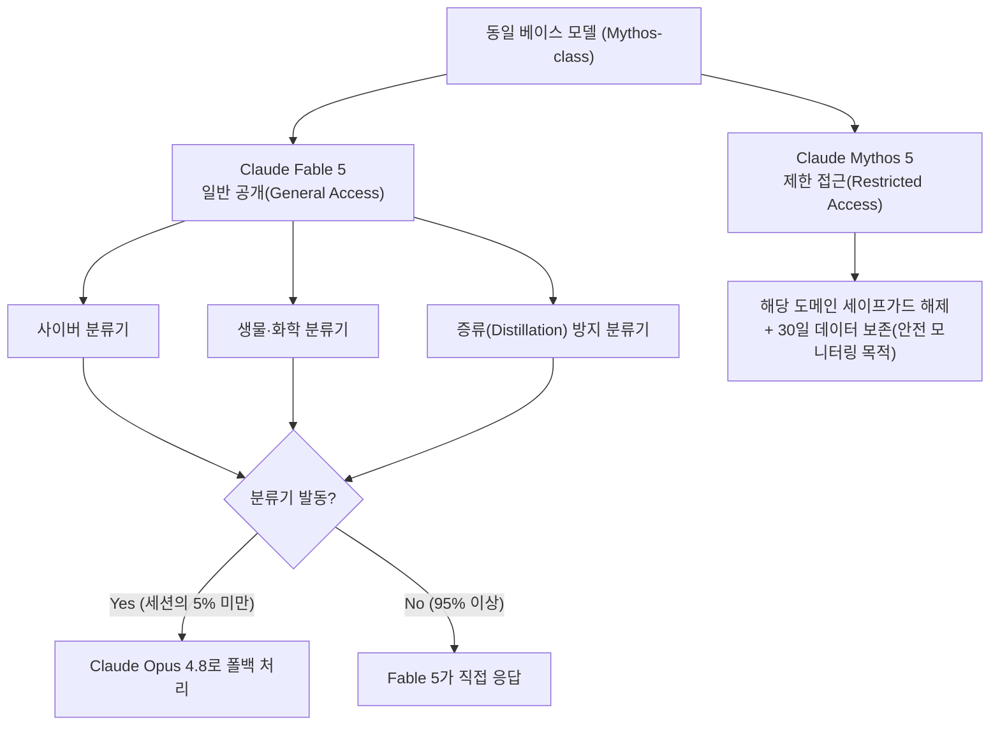
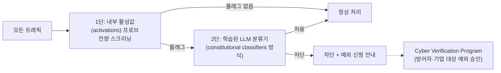
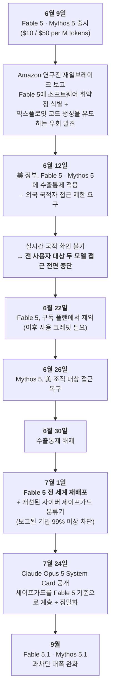
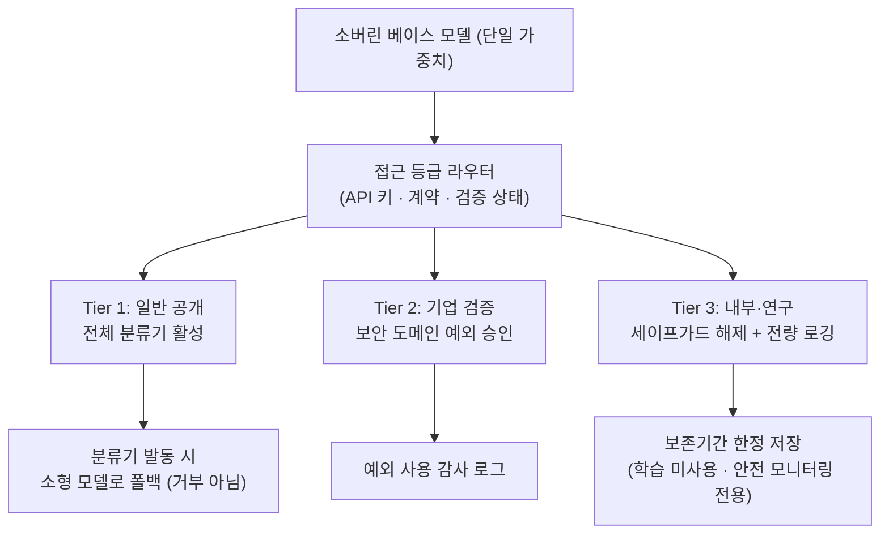

# [Week 05] Claude Opus 5 System Card & Fable 5 회수–재배포(Rollback & Redeploy) 실전 사례 분석

- **리뷰 일자**: 2026-09-07 (월)
- **트랙/갈래**: Track 2 — System Cards & Frontier Evals
- **난이도**: 🟡 중급
- **대상 문서 및 원문 링크**:
  - [Anthropic — System Card: Claude Opus 5 (2026-07-24, 193p PDF)](https://www-cdn.anthropic.com/c5fbac3f0b1280a933ebd26d3cb8bb9f5bdeaf48/Claude%20Opus%205%20System%20Card.pdf) — **본 리뷰의 1차 사료**
  - [Anthropic — System Card: Claude Sonnet 5 (2026-06-30)](https://www-cdn.anthropic.com/9e6a1044980d8c4ed85669faf9c2a8342e2e9f1e/Claude%20Sonnet%205%20System%20Card.pdf)
  - [Anthropic — Claude Fable 5 and Claude Mythos 5 (2026-06-09 출시 공지)](https://www.anthropic.com/news/claude-fable-5-mythos-5)
  - [Anthropic — Redeploying Claude Fable 5 (2026 회수·재배포 공지)](https://www.anthropic.com/news/redeploying-fable-5) — **본 리뷰의 사건 사료**
  - [Anthropic — Introducing Claude Fable 5.1 and Claude Mythos 5.1 (2026-09)](https://www.anthropic.com/claude-fable-and-mythos-5-1)
  - 보조 자료: [Gray Swan IPI 대회 논문 (arXiv:2603.15714)](https://arxiv.org/abs/2603.15714), [Adaptive attacks against LLM defenses (arXiv:2510.09023)](https://arxiv.org/abs/2510.09023)

> ✅ **사료 검증 노트**: 본 리뷰의 §2 · §3에 등장하는 모든 수치·고유명사·날짜는 위 원문(특히 Opus 5 System Card 본문과 Fable 5 재배포 공지)에서 **직접 추출**하여 대조했습니다. Week 01~04 리뷰에 남아 있던 미검증 URL 문제는 이번 주차에 함께 정리했습니다(§3.4 참조).

---

## 1. 핵심 요약 (Executive Summary)

Week 01~04에서 다룬 것이 **"위험을 어떻게 정의하고 선을 그을 것인가"**(RSP / Preparedness / FSF / EU AI Act)였다면, Week 05는 그 선이 **실제 배포 현장에서 어떻게 작동하고, 어떻게 무너졌다가, 어떻게 복구되었는가**를 다룹니다.

2026년 6월 Anthropic은 동일한 베이스 모델을 **세이프가드 유무로만 갈라놓은 두 개의 제품** — 일반 공개용 `Claude Fable 5`와 제한 접근용 `Claude Mythos 5` — 를 동시에 출시했습니다. 출시 3일 만에 Amazon 연구진이 보고한 재일브레이크와 그에 뒤이은 미국 수출통제 조치로 **두 모델 모두 전 사용자 대상 접근이 중단**되었고, 약 3주간의 세이프가드 재조정을 거쳐 재배포되었습니다. 이후 7월 공개된 **Claude Opus 5 System Card**는 이 사건에서 얻은 세이프가드 설계를 그대로 이어받되, "방어자에게는 풀어주고 공격자에게는 막는" 방향으로 **차단 정책을 정밀화**한 결과를 정량적으로 보고합니다.

- **핵심 목표**: 프론티어 모델의 사전 평가(System Card)와 사후 대응(Rollback·Redeploy)이 하나의 연속된 거버넌스 루프임을 확인하고, 그 루프를 리소스 제약 하의 독자 파운데이션 모델 조직이 재현할 수 있는 최소 단위로 분해한다.
- **주요 제안/발견**:
  1. **Fable / Mythos 이중 트랙**: 베이스 모델은 하나, **세이프가드 계층만 차등**하여 접근 등급을 나누는 배포 패턴. 능력 규제와 접근 규제를 분리한다.
  2. **RSP 판정의 실제 문장**: Opus 5는 CB-1 역량 보유 / **CB-2 미도달**, **AI R&D 자동화 임계치 미도달**로 판정되어 Opus 4.8과 동일한 **ASL-3 보호조치**가 적용되었다.
  3. **차단의 정밀화**: "사이버 = 무조건 차단"이 아니라 **소스코드 취약점 탐색은 전 접근등급 허용 / 컴파일된 바이너리 취약점 탐색은 차단**으로 공격·방어 비대칭을 이용해 선을 다시 그었다.
  4. **업계 공동 재일브레이크 심각도 프레임워크**: Anthropic·Amazon·Microsoft·Google이 합의한 4축(Capability Gain / Breadth / Ease of weaponization / Discoverability) 채점 체계가 사건 이후 도출되었다.
- **핵심 키워드**: `#ClaudeOpus5SystemCard` `#Fable5Rollback` `#DualTrackDeployment` `#ASL3` `#CB1CB2` `#JailbreakSeverityFramework` `#PromptInjection` `#OverRefusal`

---

## 2. 세부 내용 분석 (In-depth Technical Analysis)

### 2.1 Fable / Mythos 이중 트랙 배포 구조

Anthropic이 2026년 6월 9일 공개한 두 모델의 관계는 **능력 차이가 아니라 세이프가드 차이**입니다. 출시 공지는 Fable을 *"a Mythos-class model that we've made safe for general use"* 로 규정하며, 이름 자체가 라틴어 *fabula*(이야기)와 그리스어 *mythos*의 대응 관계에서 왔음을 밝힙니다.

이 구조의 핵심은 **거부(refusal)가 아니라 강등(downgrade)** 이라는 점입니다. 분류기가 발동하면 요청을 튕겨내는 대신 **덜 유능한 모델(Opus 4.8)이 대신 응답**합니다. 사용자 경험은 유지되면서 위험 역량만 제거되며, 출시 공지 기준 **Fable 세션의 95% 이상은 폴백 없이 처리**되었습니다.

---

### 2.2 Claude Opus 5의 RSP 판정 — 원문에 적힌 그대로

Opus 5 System Card §2(RSP evaluations)의 판정 문장을 원문 그대로 정리하면 다음과 같습니다.

| RSP 위험 축 | Opus 5 판정 | 근거 및 적용 조치 |
| :--- | :--- | :--- |
| **CB-1** (비신규 화학·생물 무기 합성 조력) | **역량 보유로 간주(보수적 판정)** | 기초 STEM 배경 보유자에게 유의미한 조력이 가능하다고 보수적으로 취급 → 실시간 분류기 가드, 가드 예외에 대한 접근 통제, 버그바운티·위협 인텔리전스, 재일브레이크 신속대응, 가중치 탈취 방지 보안통제 적용 |
| **CB-2** (신규 무기 개발에 필요한 희소 전문성 대체) | **임계치 미도달** | Mythos 5보다 해당 위협모델 관점에서 덜 유능하다고 결론. 블랙박스 RNA 서열 모델링·설계, AAV 캡시드 패키징 예측 등 자동 평가 수행 |
| **AI R&D 자동화** | **임계치 미도달** | AI R&D 역량은 Mythos 5와 대등하나, *"not close to substituting for our Research Scientists and Engineers"* — 극적인 AI 기인 가속 임계치를 넘지 않음 |
| **정렬(Alignment) 위험** | **매우 낮음(very low)** | Fable 5 대비 새로운 우려 속성이 관찰되지 않음. 다만 Mythos Preview 이전 모델들보다는 높다고 명시 |
| **최종 보호 등급** | **ASL-3** | CB 관점에서 Mythos 5의 위험을 초과하지 않으므로 **Opus 4.8과 동일한 ASL-3 보호조치** 적용 |

> 📌 **읽는 법**: RSP는 "안전하다"를 증명하는 문서가 아니라 **"어떤 임계치를 넘지 않았음"을 증명하고, 넘었을 가능성이 있으면 보수적으로 상위 보호를 적용**하는 문서입니다. CB-1을 "보수적으로 보유한 것으로 취급한다(conservatively treated)"는 표현이 그 태도를 압축합니다.

---

### 2.3 사이버 세이프가드 — 2단 차단과 '방어자 우대' 비대칭

Opus 5의 사이버 완화책(§3.2)은 **2단 파이프라인**입니다.

가장 주목할 설계 변경은 **차단선을 '주제'가 아니라 '공격/방어 비대칭'으로 다시 그었다**는 점입니다.

| 활동 | Fable 5 | Opus 5 | 근거 |
| :--- | :---: | :---: | :--- |
| **소스코드** 기반 취약점 탐색 | 제한 | **전 접근등급 허용** | 보안 개발 생명주기의 핵심 활동, 방어자에게 유리 |
| **컴파일된 바이너리** 취약점 탐색 | 차단 | **차단 유지** | 소스 접근 권한이 없는 공격자 쪽으로 기우는 기법 |
| 익스플로잇 개발 / 침투 테스트 | 차단 | 차단 (기업은 CVP 예외 신청 가능) | 오용 시 직접적 피해 |

역량 평가 결과도 이 판단을 뒷받침합니다. Opus 5는 **취약점을 "찾는" 능력은 Mythos 5에 근접**했지만 **"익스플로잇하는" 능력은 현저히 뒤처졌습니다.**

| 벤치마크 | Mythos 5 | **Claude Opus 5** | Opus 4.8 | Sonnet 5 |
| :--- | :---: | :---: | :---: | :---: |
| **ExploitBench** (AutoNudge 평균 flags) | 10.80 | **10.14** | 5.56 | 4.18 |
| ExploitBench (AutoNudge Cap%) | 78 | **70** | 40 | 31 |
| ExploitBench (Full ACEs) | 132 | **99** | 2 | 0 |
| **CyScenarioBench** (9-challenge 서브셋) | 47.0% | **(Opus 4.8 초과, Mythos 미달)** | 24.4% | 3.3% |

> 사용된 평가군: ExploitBench, OSS-Fuzz(228개 오픈소스 프로젝트 약 830개 엔트리포인트), Firefox 147(Mozilla 협업, Firefox 148에서 패치된 취약점 대상), CyScenarioBench(Irregular 개발), ExploitGym — 여기에 **UK AI Security Institute(UK AISI)의 외부 사이버 레인지 테스트**가 병행되었습니다. 포화되었다고 판단된 CyberGym은 평가군에서 제외되었습니다.

---

### 2.4 세이프가드 강건성 — '심각도 4축'과 외부 레드팀 실측

Opus 5 System Card §3.5는 재일브레이크를 **있다/없다**가 아니라 **심각도**로 채점합니다. 이 4축은 Fable 5 사건 이후 Anthropic·Amazon·Microsoft·Google이 합의한 업계 공통 프레임워크와 동일합니다.

| 축 | 질문 | 소버린 AI 팀의 계측 대용지표(제안) |
| :--- | :--- | :--- |
| **Capability Gain (uplift)** | 공격자가 기존 도구로 할 수 있는 수준을 얼마나 넘어서는가? | 동일 과업에 대한 오픈웹/공개 LLM 대비 성공률 델타 |
| **Breadth (universality)** | 같은 기법이 몇 개의 서로 다른 공격 과업에 통하는가? | 과업 카테고리별 전이 성공률 |
| **Ease of weaponization** | 실제 공격으로 바꾸는 데 얼마나 숙련된 노력이 드는가? | 재현에 걸린 사람-시간 |
| **Discoverability** | 위협 행위자가 그 기법을 얼마나 쉽게 손에 넣는가? | 공개 포럼/논문 노출 여부 |

**결론**: *"We have not found evidence of a critical severity jailbreak for Claude Opus 5 (this also remains true for Fable 5)."*

외부 레드팀 실측치(§3.5.2)는 소버린 AI 팀이 자체 레드팀 예산을 산정할 때 참고할 만한 **실제 투입량 벤치마크**입니다.

| 외부 테스터 | 투입량 | 결과 |
| :--- | :--- | :--- |
| **Trajectory Labs, PBC** | 약 **100시간** | 과업 1건을 과업 특화 프롬프팅으로 성공(일반화되지 않을 것으로 평가). 새로운 범용 재일브레이크 전략은 발견하지 못함 |
| **10a Labs** | 약 **16시간** | 제시된 과업을 달성하는 재일브레이크 미발견. 자동 공격기도 아직 성공 사례 없음 |
| **Gray Swan** | 과업당 **150회 시도** 자동 공격기 | 어떤 과업도 달성하지 못함 |

내부 자동 레드팀은 **공격자 모델에게 400회 호출 한도**를 주고, 차단 피드백을 받으며 이전 상태로 되감아 재시도할 수 있게 한 뒤, 랜섬웨어(암호화·키 에스크로·백업 파괴), 대규모 데이터 유출(DNS/클라우드 스토리지/웹훅), 실제 CVE(nginx, OpenSSL, glibc, Log4Shell) 원격·로컬 익스플로잇, C2, 자기복제 등 **Docker 격리 환경에서 목표 달성 여부를 자동 검증**하는 방식으로 구성됩니다.

---

### 2.5 에이전트 안전 — 프롬프트 인젝션이 실제로 얼마나 줄었는가

Opus 5의 안전성 개선 중 **가장 큰 폭의 향상은 프롬프트 인젝션 강건성**이었습니다. Gray Swan의 적응형 레드팀 도구 `Shade`로 측정한 코딩 환경 결과입니다.

| 모델 | 세이프가드 없음 (공격 성공률) | **프롬프트 인젝션 프로브 활성화 시** |
| :--- | :---: | :---: |
| **Claude Opus 5** (thinking) | **0.56%** | **0.18%** |
| **Claude Opus 5** (no thinking) | **0.41%** | **0.18%** |
| Claude Opus 4.8 (thinking) | 7.03% | 2.09% |
| Claude Opus 4.8 (no thinking) | 17.44% | 4.11% |
| Claude Sonnet 5 (thinking) | 0.31% | 0.09% |
| Claude Mythos 5 (thinking) | 0.45% | 0.41% |

세대 간 개선폭(Opus 4.8 → Opus 5, no-thinking 기준 **17.44% → 0.41%**)이 프로브라는 추가 방어층의 개선폭보다 큽니다. 즉 **모델 자체의 훈련 개선이 1차 방어선이고, 프로브는 그 위에 얹는 보험**이라는 defense-in-depth의 순서를 보여줍니다.

> 여기서 "프로브"는 모델이 행동하기 **전에 도구 실행 결과(tool results)를 검사**하여 주입된 지시처럼 보이는 내용을 표시하는 별도 레이어입니다. 컴퓨터 사용·브라우저 사용 환경에서도 동일 패턴이 측정되었습니다.

---

### 2.6 유해 요청 차단율과 **과차단(Over-refusal)** — 한국어가 평가 언어에 포함된다

Opus 5는 **16개 정책 영역 × 7개 언어(아랍어, 영어, 프랑스어, 힌디어, 한국어, 중국어, 러시아어)** 에서 단일 턴 평가를 수행합니다. **한국어가 프론티어 랩의 표준 안전 평가 언어에 포함되어 있다**는 사실은 소버린 AI 팀에게 중요한 기준점입니다.

| 모델 | 무해 응답률 (API, 시스템 프롬프트 없음) | 무해 응답률 (claude.ai) | **과차단율** (API) | **과차단율** (claude.ai) |
| :--- | :---: | :---: | :---: | :---: |
| **Claude Opus 5** | 96.34% (± 0.16%) | 98.54% (± 0.14%) | **0.09%** (± 0.02%) | **0.47%** (± 0.08%) |
| Claude Sonnet 5 | 96.65% | 99.20% | 0.59% | 1.54% |
| Claude Fable 5 | 96.94% | 98.51% | 0.01% | 0.49% |
| Claude Mythos 5 | 97.09% | N/A | 0.03% | N/A |
| Claude Opus 4.8 | 97.46% | 98.79% | 0.35% | 0.55% |

**두 가지 읽을거리**가 있습니다.

1. **Opus 5의 무해 응답률은 최근 모델 중 오히려 낮은 편입니다.** System Card는 그 원인을 숨기지 않고 *"illegal substances and disordered eating"* 영역에서 **해악 감소(harm-reduction) 프레이밍이 정당화하는 수준보다 더 구체적인 수치·정보를 제공한 사례** 때문이라고 적시합니다. 시스템 프롬프트가 이를 부분적으로 보정합니다(96.34% → 98.54%).
2. **과차단율을 나란히 보고한다는 점이 핵심입니다.** 안전성은 "얼마나 막았는가"만으로 평가할 수 없습니다. Opus 5는 claude.ai 기준 0.47%로 보고된 모델 중 가장 낮은 과차단율을 기록했고, System Card는 이를 **성과로 명시**합니다.

> 💡 국내 팀이 가장 자주 저지르는 실수가 여기 있습니다. 가드레일 KPI를 **차단율 단일 지표**로 잡으면 모델은 "의심스러우면 거부"로 수렴하고, 서비스 품질은 조용히 붕괴합니다. **차단율과 과차단율은 반드시 쌍으로 계측**해야 합니다.

---

## 3. 최근 동향 및 진화 과정 (Recent Evolution & Context)

### 3.1 Fable 5 회수–재배포 타임라인 (2026년 6~7월)

이 사건에서 소버린 AI 관점으로 반드시 짚어야 할 지점은 세 가지입니다.

1. **중단을 유발한 것은 취약점 그 자체가 아니라 '규제 조치'였습니다.** Amazon의 보고는 계기였고, 실제로 접근을 끊게 만든 것은 수출통제였습니다. Anthropic은 *"많은 덜 유능한 모델들도 동일한 일을 할 수 있음"* 을 확인했다고 밝히면서도, 세이프가드 우회가 드러난 이상 대응해야 했다고 적습니다. **기술적 심각도와 규제적 파급력은 별개로 움직입니다.**
2. **국적 검증 불가능성이 곧바로 전면 중단으로 이어졌습니다.** 실시간으로 사용자 국적을 확인할 수단이 없었기 때문에 "일부 차단"이 아니라 "전면 차단"이 유일한 선택지였습니다. **접근 통제 메타데이터를 미리 확보해 두지 않으면, 규제 대응의 최소 단위가 '전체 서비스'가 됩니다.**
3. **재배포는 모델 재훈련이 아니라 분류기 교체로 이루어졌습니다.** Anthropic은 보고된 행위를 표적하는 *"improved safety classifier"* 를 배포해 해당 기법을 **99% 이상 차단**했고, 양성 요청에도 의도적으로 분류기를 발동시키는 **"safety margin"** 접근을 확대했습니다. 즉 **핫픽스 지점은 가중치가 아니라 세이프가드 레이어**였습니다.

### 3.2 사건이 남긴 제도적 산출물

재배포 공지에서 Anthropic이 밝힌 후속 약속은 개별 기업의 대응을 넘어 **업계 표준화**로 향합니다.

- **업계 공동 재일브레이크 심각도 채점 체계** (Amazon·Microsoft·Google 참여, §2.4의 4축)
- 프론티어 모델의 **출시 전 정부 평가**
- 재일브레이크에 대한 **신속 정보 공유** 및 공동 연구팀 운영
- *"a shared, voluntary security and evaluation standard for frontier model providers"* 를 향한 작업

### 3.3 Fable 5.1 — 과차단을 되돌리는 두 번째 사이클

2026년 9월 공개된 Fable 5.1 / Mythos 5.1은 **세이프가드를 조이는 방향이 아니라 푸는 방향**의 조정을 보고합니다. 이는 §2.6에서 본 "차단율·과차단율 쌍 계측"의 실전 귀결입니다.

| 영역 | 5.1의 조정 | 보고된 효과 |
| :--- | :--- | :--- |
| **사이버 세이프가드** | 취약점 식별은 허용하되 익스플로잇 생성·침투 테스트는 제한 | 세션당 개입 **약 60% 감소** |
| **생물 세이프가드** | 기초 생물학·의학 질문에 대한 오발동 축소 | 양성 요청에 대한 발동 **85% 감소** |
| **강건성 검증** | 외부 독립기관 2곳 + Gray Swan 자동 테스트 | *"no evidence of a critical-severity jailbreak"* |

역량 지표도 함께 개선되어(에이전틱 과학 연구 24.7% → 52.6%, 에이전틱 코딩 42.0% → 55.8%), **세이프가드 완화와 역량 향상이 동시에 일어난 사이클**임을 보여줍니다.

### 3.4 📌 본 저장소의 사료 정합성 정리 (이번 주차 수행)

Week 01~04 리뷰가 인용한 URL 중 **실제로 존재하지 않는 링크가 다수 확인**되어 이번 주차에 함께 정리했습니다. 안전 거버넌스를 다루는 저장소에서 출처가 404를 반환하는 것은 그 자체로 신뢰성 결함이므로, 앞으로 **모든 리뷰는 인용 URL의 HTTP 상태 확인을 통과한 뒤 커밋**합니다.

| 기존 링크 | 상태 | 조치 |
| :--- | :---: | :--- |
| `anthropic.com/news/claude-5-family` | 404 | Opus 5 / Sonnet 5 System Card PDF 실제 링크로 교체 |
| `anthropic.com/news/responsible-scaling-policy-v2` | 404 | `announcing-our-updated-responsible-scaling-policy` 로 교체 |
| `anthropic.com/news/clio-constitutional-ai` | 404 | `research/constitutional-ai-harmlessness-from-ai-feedback` + arXiv:2212.08073 으로 교체 |
| `anthropic.com/news/reasoning-model-safety` | 404 | 삭제 후 실재 문서로 대체 |
| `anthropic.com/news/eu-ai-act-compliance` | 404 | `anthropic.com/transparency` 로 교체 |
| DeepMind FSF PDF (구 경로) | 404 | `deepmind.google/blog/strengthening-our-frontier-safety-framework/` (FSF v3.0) 로 교체 |
| `deepmind-media/gemini/gemini_3_7_report.pdf` | 404 | 제거 (Week 07에서 실제 문서로 재확인 예정) |

---

## 4. 🇰🇷 한국 독자 파운데이션 모델(Sovereign AI) 개발 관점 시사점

> **"세이프가드는 한 번 만들어 끝나는 정적 자산이 아니라, 사건이 터질 때마다 교체되는 운영 컴포넌트다. 그렇다면 교체 가능하도록 설계되어 있는가?"**

### 4.1 리소스 및 인프라 현실성 (Cost & Feasibility)

**(1) Fable/Mythos 패턴의 경량 이식 — 모델을 두 벌 만들지 않는다**

국내 독자 모델 조직이 공공·규제 산업(금융/의료)과 일반 B2C를 동시에 서빙해야 할 때, 흔한 실수는 **용도별로 모델을 따로 파인튜닝**하는 것입니다. Fable/Mythos 패턴은 **베이스 가중치는 하나로 두고 세이프가드 계층에서만 등급을 나눕니다.**

**비용상의 이점**: 모델 학습 비용은 1회분, 늘어나는 것은 분류기 학습·서빙 비용뿐입니다. 폴백 대상은 자사의 이전 세대 소형 모델을 재활용하면 됩니다.

**(2) 2단 차단 파이프라인의 저비용 재현**

Anthropic의 "활성값 프로브 → LLM 분류기" 구조는 **전량 스크리닝은 싸게, 정밀 판정은 비싸게**라는 비용 배분 원칙의 구현입니다.

| 단계 | Anthropic | 국내 저비용 대안 |
| :--- | :--- | :--- |
| 1단 (전량) | 내부 활성값 선형 프로브 | 자사 모델 히든스테이트에 학습한 **선형 프로브** 또는 경량 임베딩 분류기 (수 ms 수준) |
| 2단 (플래그된 것만) | 학습된 LLM 분류기 | **Llama Guard 계열 + 한국어 유해성 데이터로 파인튜닝**한 소형 판정 모델 |
| 예외 처리 | Cyber Verification Program | 기업 고객 대상 **사전 심사 기반 도메인 예외** + 감사 로그 |

핵심은 1단을 **모델 외부 텍스트 필터가 아니라 모델 내부 표현 기반으로** 두는 것입니다. 번역·인코딩 우회에 훨씬 강합니다(→ Week 12 해석가능성 트랙과 연결).

---

### 4.2 한국어 및 로컬 맥락 특수성 (Cultural, Linguistic & Legal Specifics)

**(1) "한국어가 평가 언어에 포함되어 있다"는 사실을 오해하면 안 됩니다**

Opus 5는 한국어를 포함한 7개 언어로 안전 평가를 수행합니다. 이는 **언어 커버리지**이지 **법·문화 맥락 커버리지가 아닙니다.** 16개 정책 영역은 Anthropic의 Usage Policy 기준이므로, 다음은 구조적으로 빠져 있습니다.

- **개인정보보호법상 고유식별정보** (주민등록번호 체계, 계좌·카드번호 형식) 유출 패턴
- **국내 특화 금융 범죄 조력** — 보이스피싱 시나리오 작성, 대포통장·작업대출 안내
- **한국 현대사·지역·정치 쟁점**에서의 편향 및 유도 응답
- **국내 의료·법률 자격 규제**를 우회하는 무면허 상담 프레이밍

즉, 글로벌 랩의 한국어 평가는 **바닥선(floor)**이지 목표가 아닙니다. 소버린 모델의 차별화 지점은 정확히 이 빈칸입니다.

**(2) 회수 사건이 국내 규제 환경에서 재현될 때**

Fable 5 사건의 방아쇠는 **수출통제 × 실시간 국적 확인 불가**였습니다. 국내에서 이와 구조적으로 동형인 시나리오는 다음과 같습니다.

| 글로벌 사례 | 국내 대응 시나리오 | 사전 준비 사항 |
| :--- | :--- | :--- |
| 수출통제로 외국 국적자 차단 요구 | 공공 조달 계약상 **국내 데이터 경계** 요구, 특정 사용자군 제한 | 계약·과금 메타데이터와 **접근 등급을 실시간 조회 가능한 상태**로 보관 |
| 실시간 국적 확인 불가 → 전면 중단 | 사용자군 식별 불가 → 서비스 전체 중단 | 최소한 **테넌트/조직 단위 즉시 차단 스위치** 확보 |
| 분류기 교체로 3주 내 재배포 | 인공지능기본법상 사고 통지 후 시정 | **가중치 재훈련 없이 교체 가능한 세이프가드 레이어** 분리 설계 |

---

### 4.3 우리 팀이 당장 적용할 Action Items (Top 3)

| 구분 | 실행 과제 (Action Item) | 세부 구현 가이드 | 담당 및 산출물 |
| :--- | :--- | :--- | :--- |
| **1. [단기/즉시] 운영 대응** | **회수–재배포 인시던트 런북 수립** | 탐지→심각도 채점(4축)→차단 범위 결정→분류기 핫픽스→재배포→공개 보고의 6단계를 시간 목표(RTO)와 함께 문서화. Week 04 액션 아이템 #3의 이행 | AI 거버넌스 + SRE / [`resources/incident_runbook.md`](../../resources/incident_runbook.md) |
| **2. [중기/모델 학습] 평가 체계** | **차단율 · 과차단율 쌍(pair) 회귀 평가셋 구축** | 16개 정책 영역 × 한국어 유해/양성 프롬프트 쌍을 최소 각 300건 확보하고, 배포 게이트에 **"과차단율 상승 시 배포 중단"** 조건 추가 | 안전성 평가팀 / 회귀 평가 CI |
| **3. [배포/운영] 아키텍처** | **세이프가드 레이어의 가중치 분리(hot-swappable) 설계** | 분류기·프로브를 모델 서빙과 별도 배포 단위로 분리하고, **가중치 재훈련 없이 1시간 내 교체 가능**함을 분기별 훈련(drill)으로 검증 | 플랫폼 엔지니어링 / 교체 드릴 리포트 |

---

## 5. 논의할 질문 (Discussion Questions & Open Issues)

- **Q1. 폴백(fallback)이 거부(refusal)보다 항상 나은가?**
  Fable 5는 분류기 발동 시 덜 유능한 모델로 강등시켜 응답합니다. 사용자 경험은 좋아지지만, **사용자는 자신이 강등된 모델과 대화 중임을 모릅니다.** 이는 투명성 원칙과 충돌하지 않는가? 국내 서비스에서 "지금 응답은 제한 모드에서 생성되었습니다"를 고지해야 하는 법적 기준선은 어디인가?

- **Q2. 차단선을 '주제'가 아니라 '공격/방어 비대칭'으로 긋는 접근의 한계는?**
  Opus 5는 소스코드 취약점 탐색을 허용하고 바이너리 취약점 탐색을 차단합니다. 그러나 공격자가 소스를 확보한 경우(오픈소스 공급망 공격)에는 이 비대칭이 무너집니다. 국내 환경에서 이와 동형인 **"방어자에게 유리해 보이지만 실제로는 공격자도 동일하게 쓰는"** 영역은 무엇인가?

- **Q3. 심각도 4축을 자체 계측할 수 있는가?**
  Capability Gain은 "공격자의 기존 도구 대비 델타"로 정의됩니다. 이를 측정하려면 **비교 기준선(오픈웨이트 모델, 공개 검색)의 능력을 상시 추적**해야 합니다. 리소스가 제한된 조직이 이 기준선을 유지하는 현실적인 방법은? 오픈웨이트 모델 벤치마크를 공동 운영하는 국내 컨소시엄이 대안이 될 수 있는가?

- **Q4. 과차단율을 배포 게이트 조건으로 삼을 때의 위험은?**
  "과차단율이 오르면 배포 중단"이라는 규칙은 안전 강화 조치를 억제하는 방향으로도 작동할 수 있습니다. 두 지표가 충돌할 때의 의사결정 권한은 누구에게 있어야 하는가? (→ Week 02의 RSO, Week 03의 SAG 거버넌스 구조와 연결)

---

## 6. 참고 문헌 및 추가 리소스

1. **Claude Opus 5 System Card (본 리뷰 1차 사료, 2026-07-24, 193p)**
   - [System Card: Claude Opus 5](https://www-cdn.anthropic.com/c5fbac3f0b1280a933ebd26d3cb8bb9f5bdeaf48/Claude%20Opus%205%20System%20Card.pdf)
   - 주요 참조 섹션: §2 RSP evaluations, §3 Cyber, §4 Safeguards and harmlessness, §5 Agentic safety, §6 Alignment assessment
2. **Fable 5 회수–재배포 사건 사료**
   - [Claude Fable 5 and Claude Mythos 5 (출시 공지)](https://www.anthropic.com/news/claude-fable-5-mythos-5)
   - [Redeploying Claude Fable 5 (재배포 공지)](https://www.anthropic.com/news/redeploying-fable-5)
   - [Introducing Claude Fable 5.1 and Claude Mythos 5.1](https://www.anthropic.com/claude-fable-and-mythos-5-1)
   - [Claude Platform Docs — Introducing Claude Fable 5 and Claude Mythos 5](https://platform.claude.com/docs/en/about-claude/models/introducing-claude-fable-5-and-claude-mythos-5)
3. **비교 시스템 카드**
   - [System Card: Claude Sonnet 5 (2026-06-30)](https://www-cdn.anthropic.com/9e6a1044980d8c4ed85669faf9c2a8342e2e9f1e/Claude%20Sonnet%205%20System%20Card.pdf)
   - [Claude Opus 4.5 System Card (2025-11)](https://www.anthropic.com/claude-opus-4-5-system-card)
4. **프롬프트 인젝션 관련 연구**
   - [How vulnerable are AI agents to indirect prompt injections? A Large-Scale Public Competition (arXiv:2603.15714)](https://arxiv.org/abs/2603.15714)
   - [Stronger adaptive attacks bypass defenses against LLM jailbreaks and prompt injections (arXiv:2510.09023)](https://arxiv.org/abs/2510.09023)
5. **선행 주차 리뷰 문서**
   - [Week 02 — Anthropic RSP & ASL 프레임워크](../week-02/review_week02.md)
   - [Week 03 — OpenAI Preparedness Framework & 위험 임계치](../week-03/review_week03.md)
   - [Week 04 — DeepMind FSF & EU AI Act 컴플라이언스](../week-04/review_week04.md)
   - [경량 RSP & 비상 거버넌스 블루프린트](../../resources/lightweight_rsp_blueprint.md)
   - [회수–재배포 인시던트 런북](../../resources/incident_runbook.md) *(본 주차 신규)*
